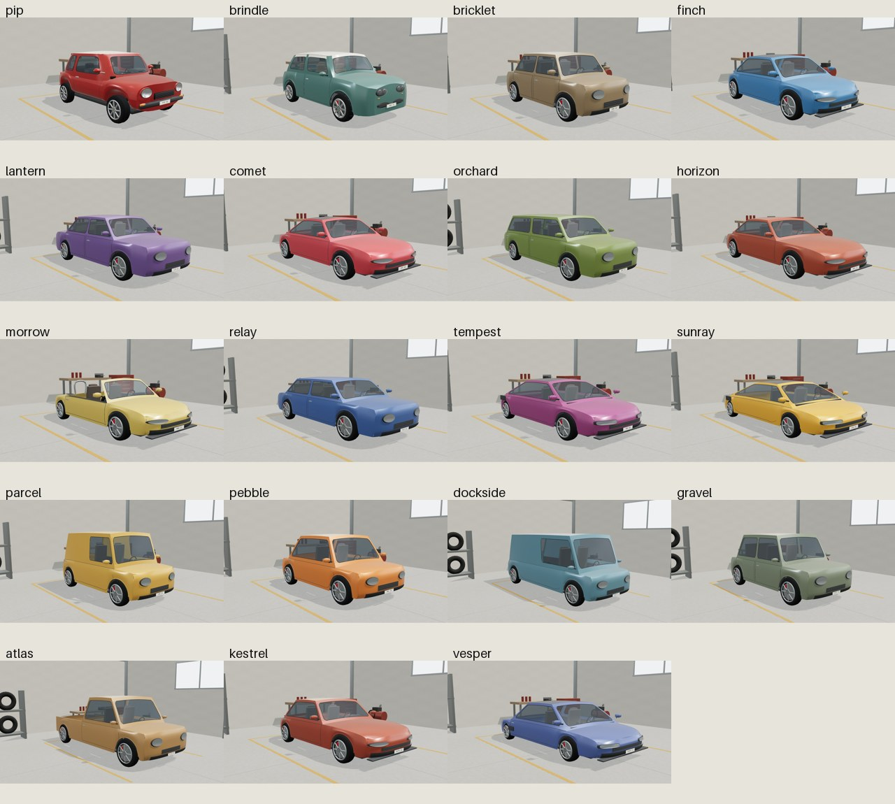
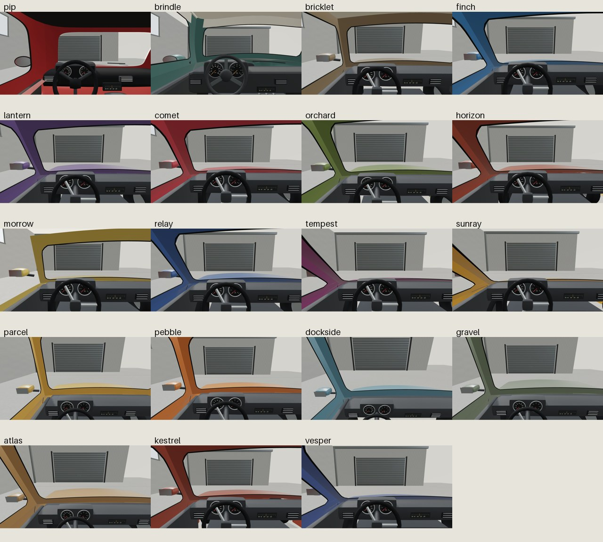

# Detailed parked fleet: real renders

Actual local Chromium/SwiftShader pixels at source **f9169da**, not generated photographs or a fresh driving-fleet replacement. All19 selectors rendered exterior and physical-cockpit views; Main opened both complete contact sheets and the individual Kestrel/Vesper exteriors, Vesper/Atlas cabins. Earlier first batch passed its capture assertions but Main rejected the block-like noses and dashboard framing; it is not the accepted final image set. Main corrected the common stamping/camera construction before this new batch.

## Each model

| Model | Exterior | Physical cockpit |
| --- | --- | --- |
| Pip Borough (existing study) | [Pip](pip-exterior.jpg) | [Pip cabin](pip-cockpit.jpg) |
| Brindle Borough (existing study) | [Brindle](brindle-exterior.jpg) | [Brindle cabin](brindle-cockpit.jpg) |
| Bricklet80 | [Bricklet](bricklet-exterior.jpg) | [Bricklet cabin](bricklet-cockpit.jpg) |
| Finch Sport | [Finch](finch-exterior.jpg) | [Finch cabin](finch-cockpit.jpg) |
| Lantern Saloon | [Lantern](lantern-exterior.jpg) | [Lantern cabin](lantern-cockpit.jpg) |
| Comet Coupe | [Comet](comet-exterior.jpg) | [Comet cabin](comet-cockpit.jpg) |
| Orchard Wagon | [Orchard](orchard-exterior.jpg) | [Orchard cabin](orchard-cockpit.jpg) |
| Horizon GT | [Horizon](horizon-exterior.jpg) | [Horizon cabin](horizon-cockpit.jpg) |
| Morrow Roadster | [Morrow](morrow-exterior.jpg) | [Morrow cabin](morrow-cockpit.jpg) |
| Relay Touring | [Relay](relay-exterior.jpg) | [Relay cabin](relay-cockpit.jpg) |
| Tempest Sprint | [Tempest](tempest-exterior.jpg) | [Tempest cabin](tempest-cockpit.jpg) |
| Sunray Halo | [Sunray](sunray-exterior.jpg) | [Sunray cabin](sunray-cockpit.jpg) |
| Parcel Cub | [Parcel](parcel-exterior.jpg) | [Parcel cabin](parcel-cockpit.jpg) |
| Pebble Rally | [Pebble](pebble-exterior.jpg) | [Pebble cabin](pebble-cockpit.jpg) |
| Dockside Van | [Dockside](dockside-exterior.jpg) | [Dockside cabin](dockside-cockpit.jpg) |
| Gravel Scout | [Gravel](gravel-exterior.jpg) | [Gravel cabin](gravel-cockpit.jpg) |
| Atlas Utility | [Atlas](atlas-exterior.jpg) | [Atlas cabin](atlas-cockpit.jpg) |
| Kestrel R (new original sports concept) | [Kestrel](kestrel-exterior.jpg) | [Kestrel cabin](kestrel-cockpit.jpg) |
| Vesper GT (new original sports concept) | [Vesper](vesper-exterior.jpg) | [Vesper cabin](vesper-cockpit.jpg) |

[390px exterior UI](390-exterior-ui.jpg) / [390px cabin UI](390-cockpit-ui.jpg) / [exact capture evidence](evidence.json).

## Actual outcome and limits

- Current visual-only batch: **exit0 /185.5178s**,42 original captures,3,249,228 original JPEG bytes, no recorded console/page/request/HTTP errors, strictly local frozen-source requests, exact physical eyes, nonblank images, real keyboard and touch at390px, source hashes unchanged. External capture-folder basename `car-fleet-visual-20te1smd`; ledger `car-fleet-detail-visual-2`.
- Stored44 JPEGs total3,652,370bytes: those42 captures plus two clearly labeled contact-sheet derivatives. No photograph, downloaded OEM texture/mesh/HDR or retouched synthetic geometry is substituted. Main source grew41,262bytes across six authored/test paths relative656d85f, before documentation/previews; shared filesystem free-before/after in evidence is not an isolated storage-cost claim.
- Main Node checks pass **19 factories x two fresh/disjoint once-disposed cycles**. New17 factories:22,838–28,858 total triangles /28–29meshes; existing Pip29,166/26 and Brindle29,378/35 unchanged. Each decorated car9 textures/983,040 baseRGBAbytes (mipmap overhead separate); observed live studio textures19 throughout. Actual instrument-face projection and non-flat nose regressions accompany the refinement. Stub canvas is not typography evidence; visible text is reviewed in actual pictures.
- Broad sedan/coupe/fastback/wagon/open-roadster/van/scout/pickup forms differ; sports variants have lower/tapered rounded stampings, cooling grille/splitter and original detail differences. Shared dashboard/rim design language remains. Headlamp/hood transitions, cabin-frame joins and family-specific surfacing still need further refinement. **These remain stylized, not photographic or certified equal artistic quality to every existing study.**
- Kestrel R/Vesper GT are original generic sports intentions, **not selectable live gameplay cars**, branded replicas, measured performance or legal-clearance certificates. No Ferrari/Porsche/OEM artwork, branding or traced proprietary designs were imported; original names alone cannot prove noninfringement.
- Both game fleets remain16 cached low-cost models, unchanged. No game registration, new game, catalog edit, push or driving integration. The unchanged20s focused studio startup gate remains HELD from earlier work; this batch's60s visual readiness does not clear it. Actual game/multi-car cost and storage migration need verification before any live replacement. Full catalog release, rights and physical-device FPS remain separate gates.

[Implementation/source contract](../car-fleet-detail-plan.md) / [current studio](../../assets/car-arcade/showcase/index.html).
