# Each original gameplay car

Individual JPEG derivatives of the actual local-browser gallery reviewed in [Main's fleet evidence](../car-fleet-native-review.md). Source capture folder basename: `car-fleet-native-bb6jtujp`. These are existing renders, not fresh captures or generated photography. The shared gameplay factory has not changed since `a8edf08`; this preview request adds no game/model edits. All sixteen are stylized original procedural models. No OEM likeness, legal clearance or hardware acceptance is claimed.

| Car | Preview |
| --- | --- |
| Bricklet80 | 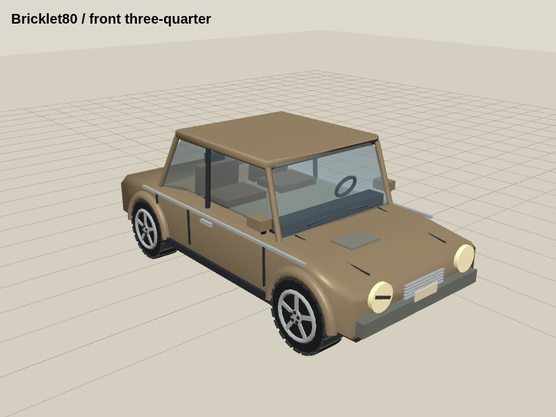 |
| Pip Borough | 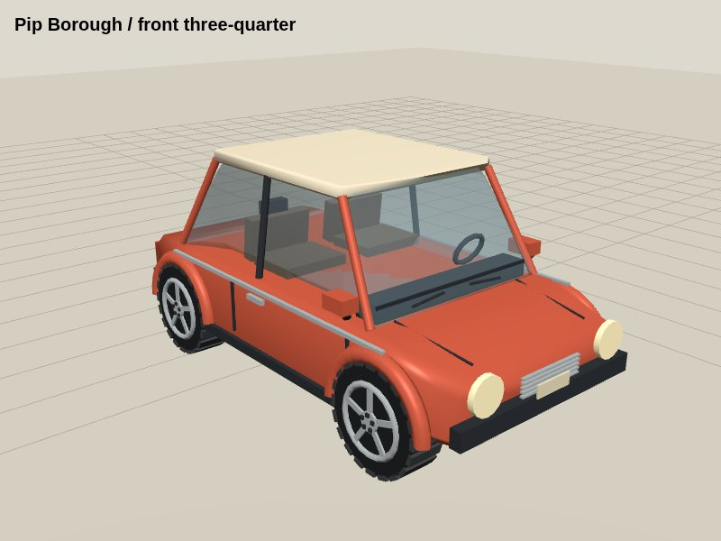 |
| Parcel Cub | 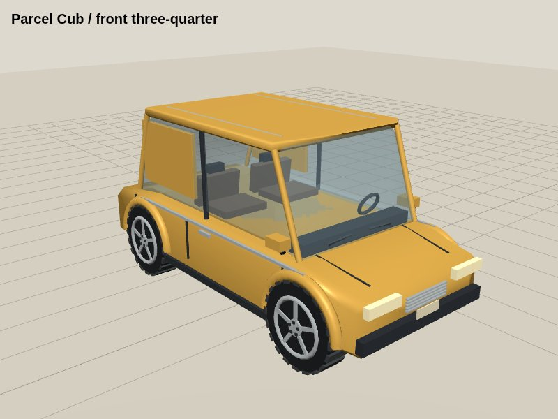 |
| Finch Sport | 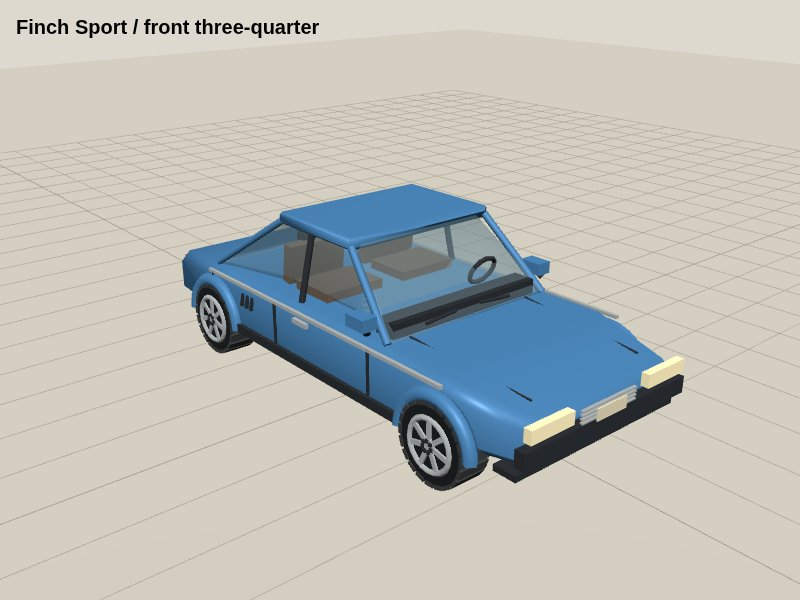 |
| Lantern Saloon | 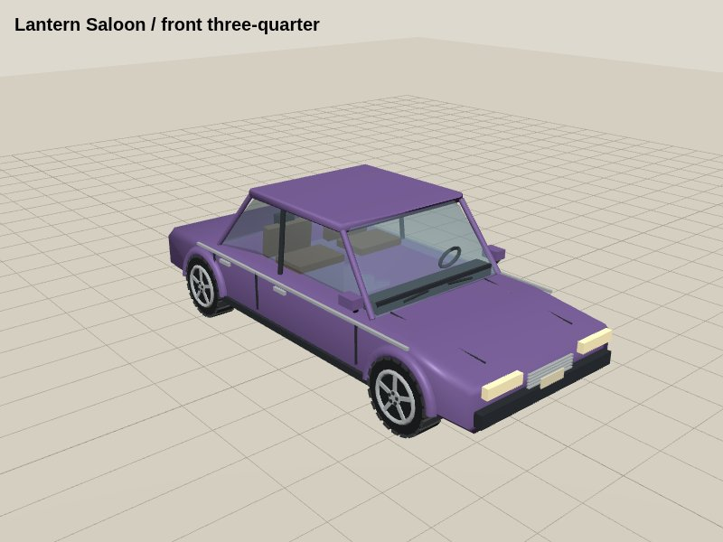 |
| Comet Coupe | 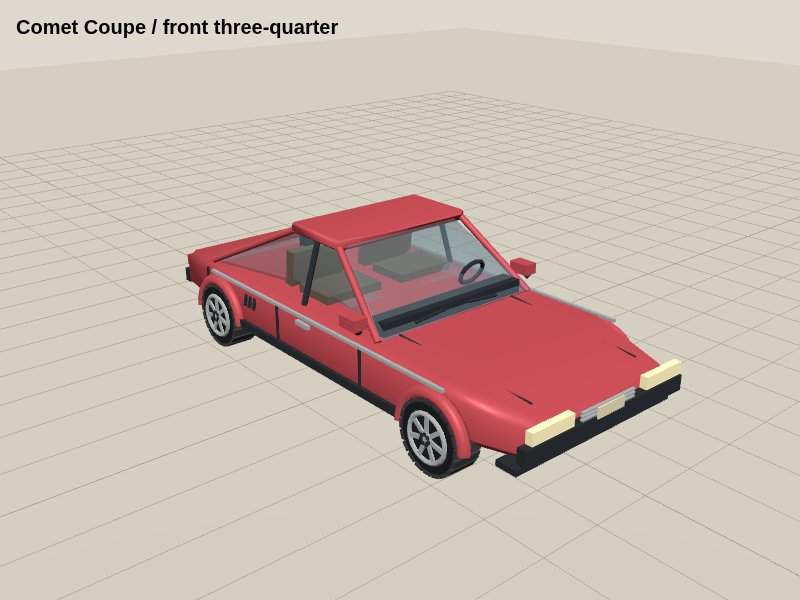 |
| Orchard Wagon | 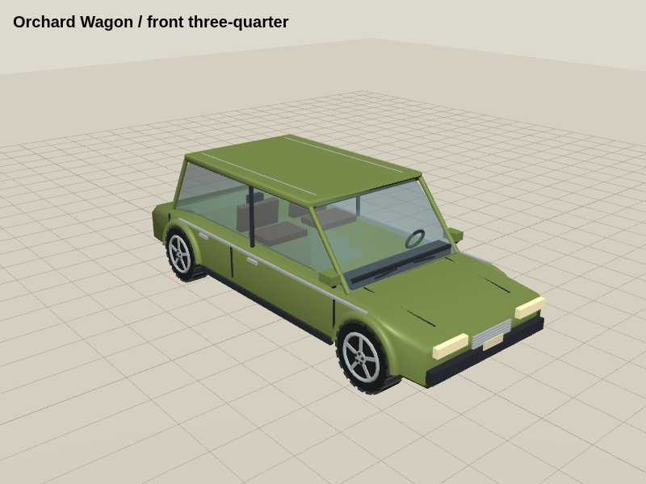 |
| Pebble Rally | 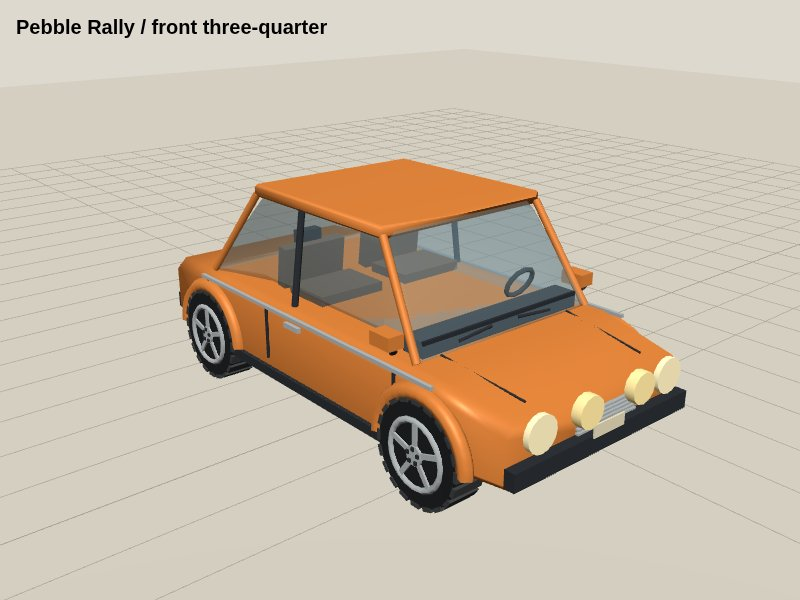 |
| Dockside Van | 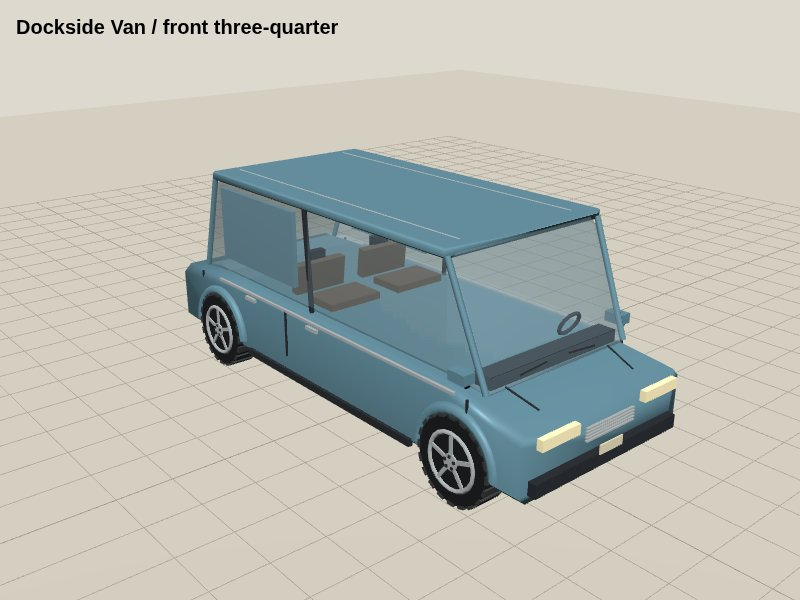 |
| Horizon GT | 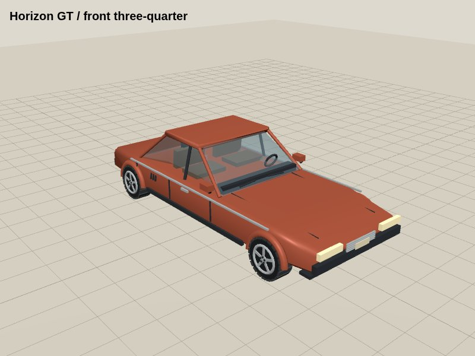 |
| Morrow Roadster | 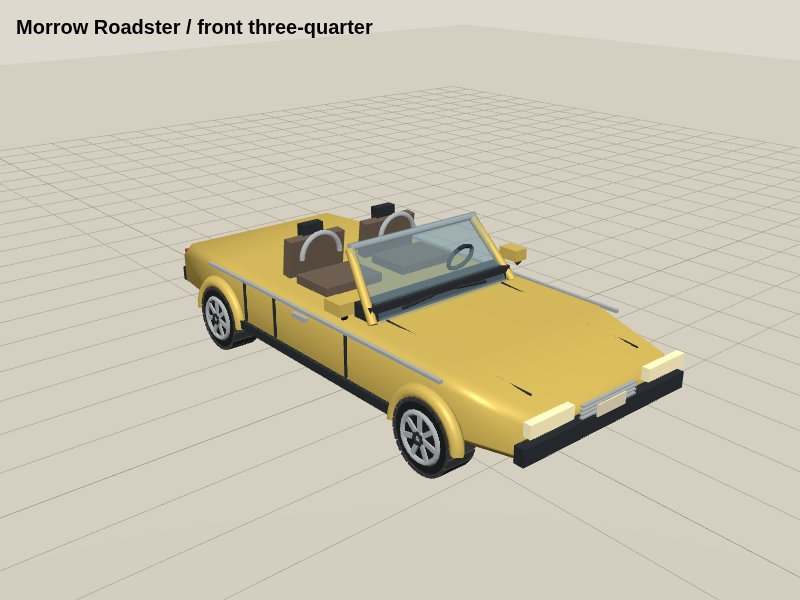 |
| Gravel Scout | 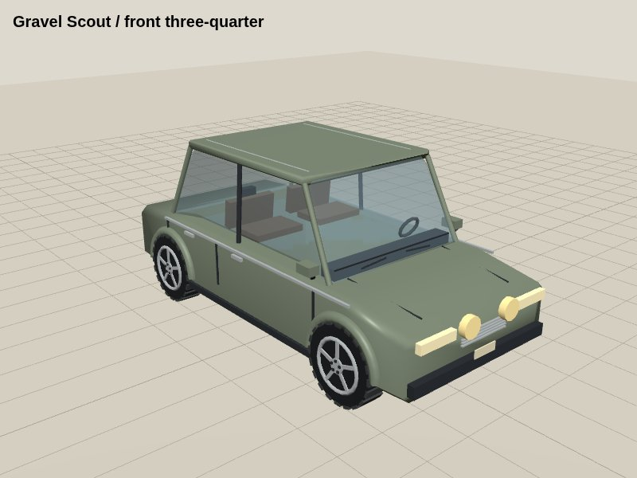 |
| Relay Touring | 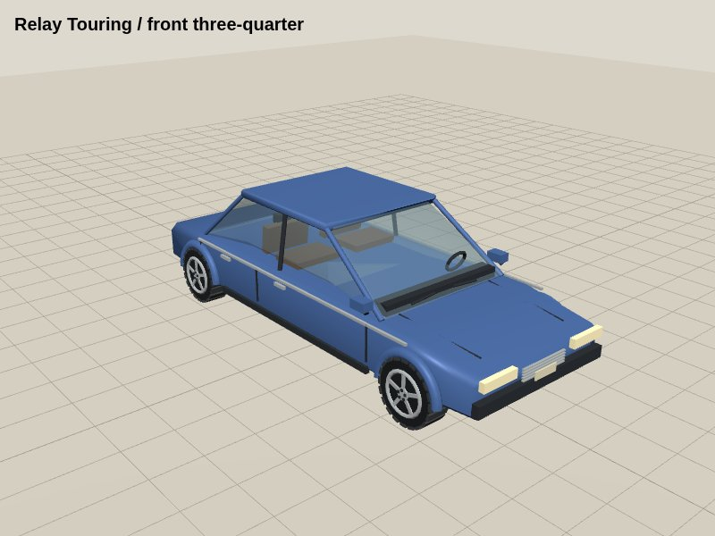 |
| Tempest Sprint | 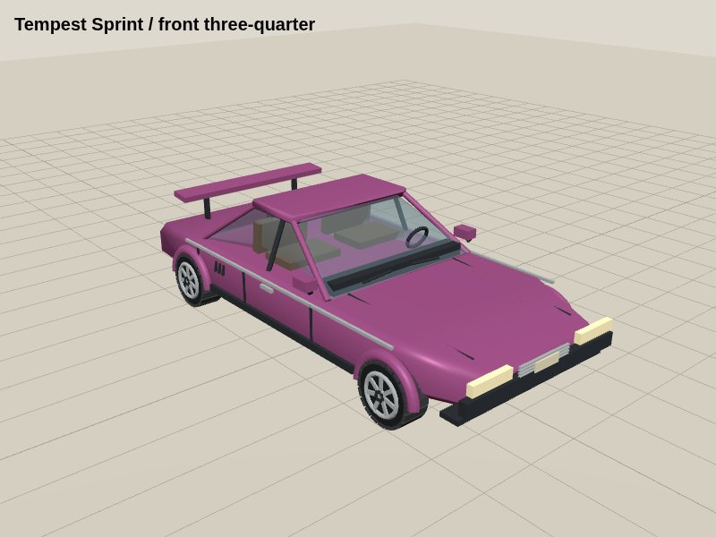 |
| Atlas Utility | 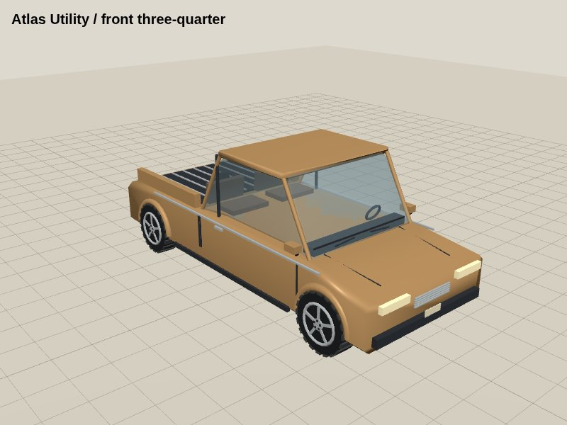 |
| Sunray Halo | 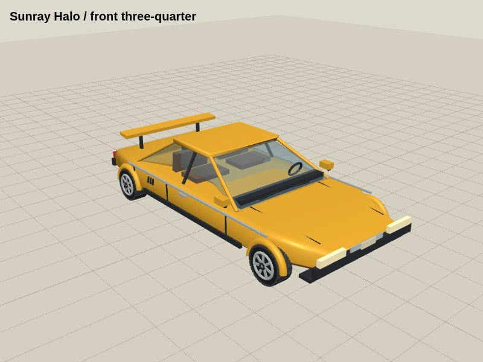 |

The separate [Pip](../car-photo-previews/pip-exterior.jpg) and [Brindle](../car-photo-previews/brindle-exterior.jpg) detailed parked studies are not installed in the gameplay fleet. Their cockpit views and remaining photographic/startup limitations are in the [study preview record](../car-photo-previews/README.md).
