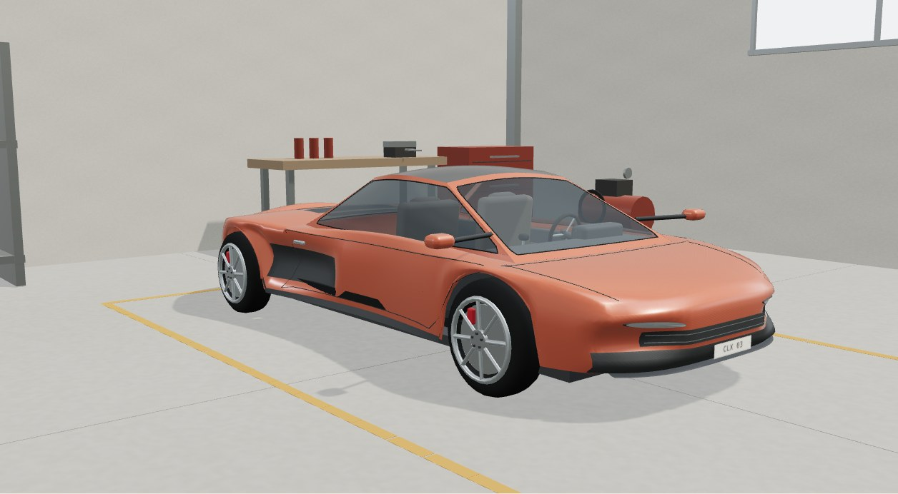
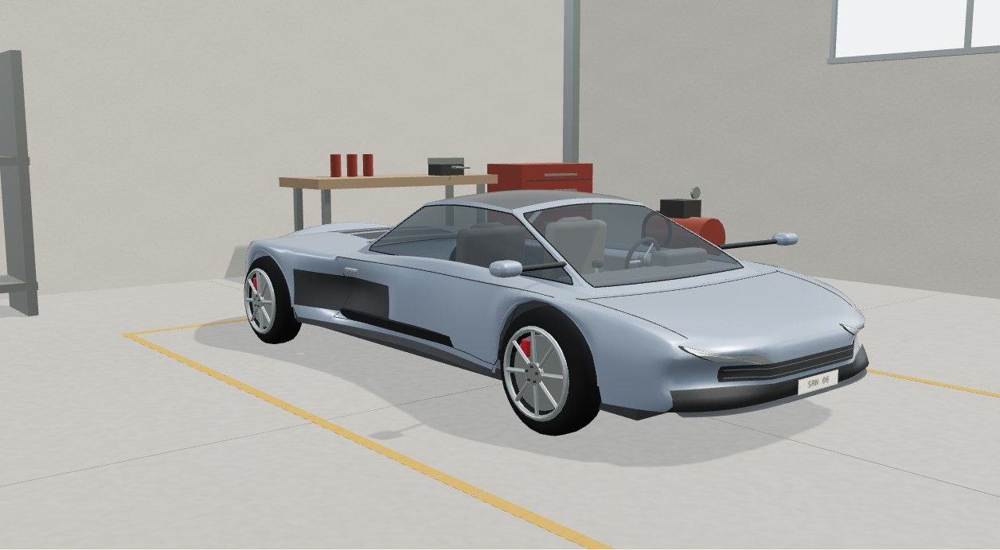
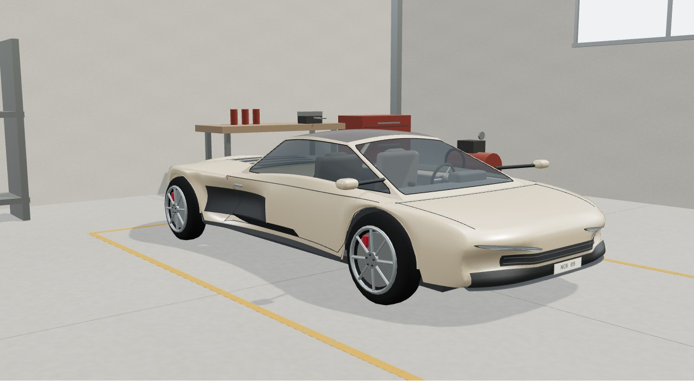
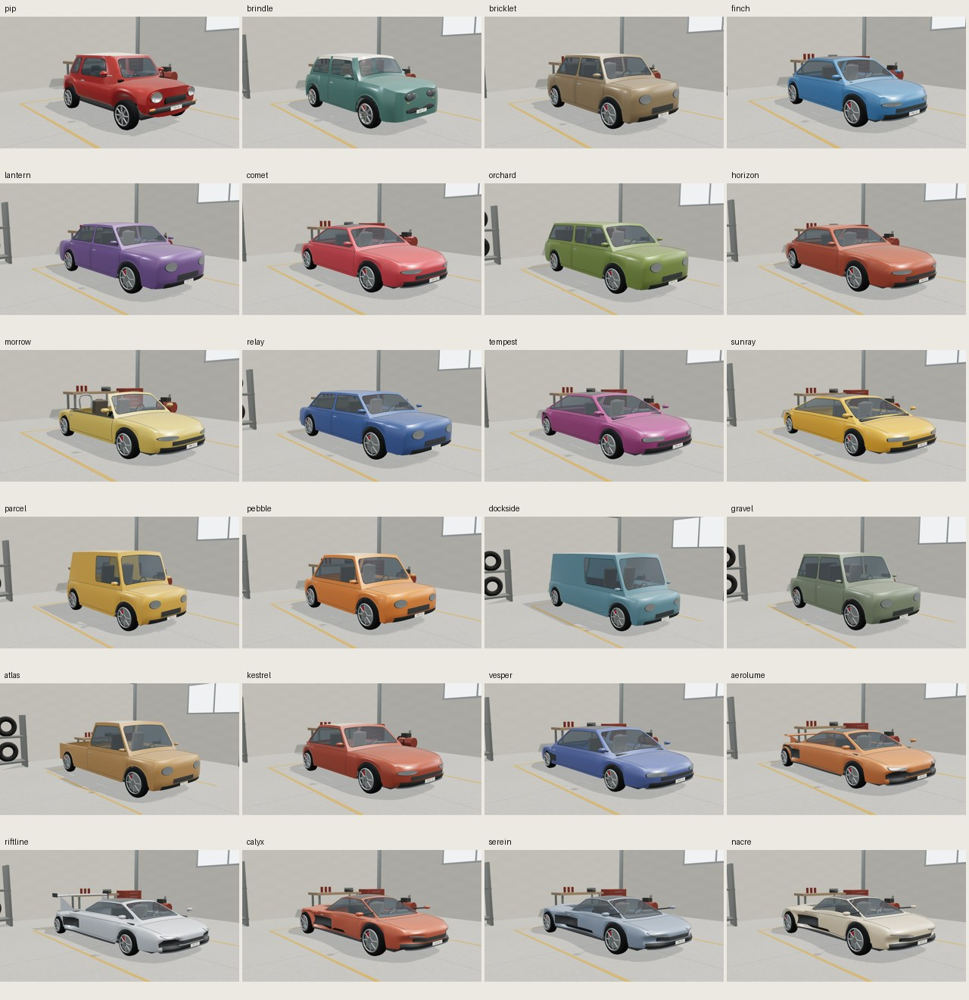
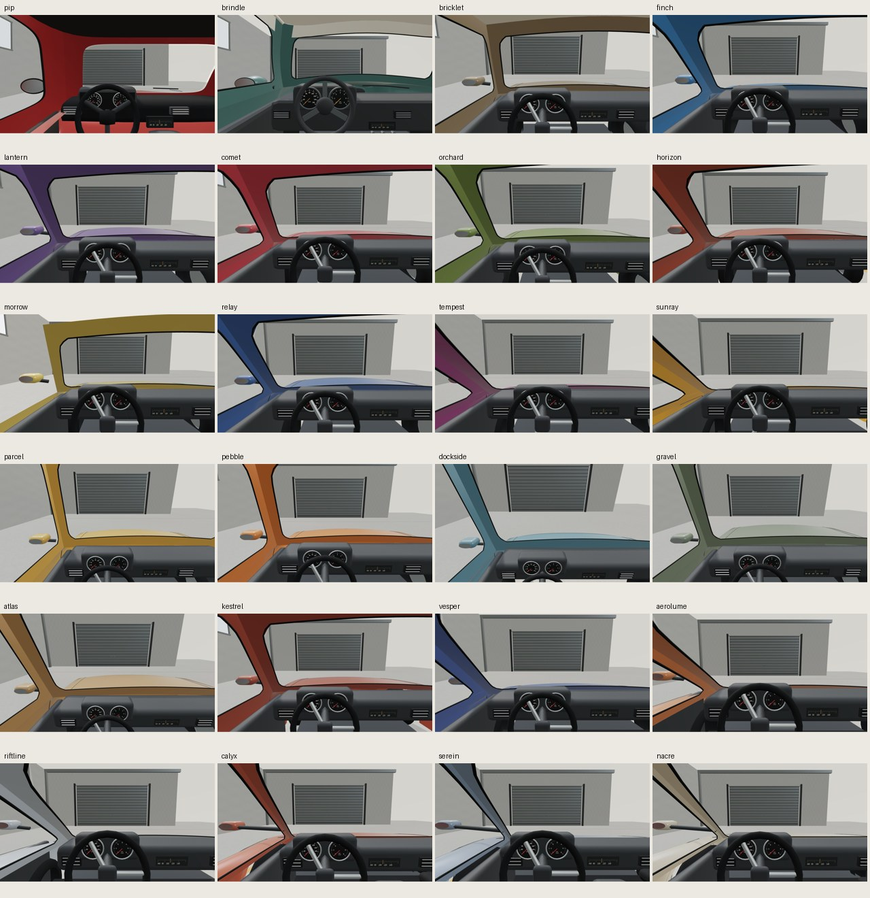

# Three original modern supercar studies

**Calyx S, Serein R and Nacre V** are original closed mid-engine parked concepts, not the rejected luxury GT/speedster/targa proposal. [Open the 24-car studio](../../assets/car-arcade/showcase/index.html). Existing 21 studies remain byte-identical in geometry, profiles, materials, transforms and camera metadata. These three are **not drivable or installed in either game**. No OEM assets, photography, downloaded artwork or new dependencies. Original naming/geometry is not legal clearance.

## Reviewed renders

| Model | Exterior | Rear | Physical cockpit |
| --- | --- | --- | --- |
| Calyx S | [View](calyx-exterior.jpg) | [View](calyx-rear.jpg) | [View](calyx-cockpit.jpg) |
| Serein R | [View](serein-exterior.jpg) | [View](serein-rear.jpg) | [View](serein-cockpit.jpg) |
| Nacre V | [View](nacre-exterior.jpg) | [View](nacre-rear.jpg) | [View](nacre-cockpit.jpg) |

[390px exterior UI](390-exterior-ui.jpg) | [390px cockpit UI](390-cockpit-ui.jpg)

## Actual checks and limitations

Frozen source **4b7518d**; [source hashes, snapshots and JPEG hashes](evidence.json). Installed system Chromium visual-only batch exited **0 / 315.9409s**: 57 images, 4,497,903 capture JPEG bytes, zero recorded errors, frozen/local requests, nonblank frames, exact physical cockpit eyes, 19 live textures, normal rear-rotation buttons and genuine keyboard/touch at 390px. Main opened all three new fronts/rears/cabins, full contact sheets and mobile UI. Stored only the 13 new/mobile pictures and two full contact derivatives: **15 JPEGs / 1,528,518 bytes**; other full-size images remain in the external evidence folder. Existing [21-study gallery](../car-polished-previews/README.md) remains historical, not replaced with duplicate files.

All 24 factories pass two fresh cycles, finite matching UVs/normals, ground/four-wheel checks, actual instrument projection, physical narrow-cabin/cooling/windshield/lamp rays, shape checks and disjoint exactly-once disposal. Calyx **27,454 triangles**, Serein/Nacre **27,502**, each **29 meshes** and nine fresh generated maps/**983,040 base RGBA bytes**; mip overhead separate. Old Pip/Brindle material and live 16-car cached factory regressions pass. All 21 protected fingerprints remain unchanged.

First pure suite failed because full-width inner door cards protruded through new recessed cooling hulls. **81a062d** fixes their physical width, not the camera or test. Its first native batch exited 0/304.1348s but was visually rejected for serrated color boundaries, partially buried lamps and detached mirror stems. **4b7518d** partitions complete hull quads, ends cooling before wheel apertures, attaches lamps to actual cap triangles and roots mirror arms on the real pillar. The intermediate partition check failed on profile/position variable shadowing; corrected before final capture. Failure logs and rejected images retained externally. No assertions or startup waits were relaxed.

These remain **stylized family designs**, with shared analogue interiors, simple cabin joins, long mirror arms and modest silhouette differences. This is not photorealism, subjective artistic-parity, rights, hardware/FPS or driving-cost certification. Visual readiness 60s/navigation 20s does **not** clear the unchanged focused 20s startup gate. Live games/fleet/saves/catalog/vendor unchanged; no new game, registration, full release gate or push.

## Separate equipment agent

[Rear-fascia mounts, bounded passive perks and optional pickups](../car-modern-equipment-plan.md) were designed by a separate genuine Astra agent. **All new mounts/perks/pickups are proposed and unimplemented**, not shown as fitted in these pictures. Existing five-kit game rules and the fresh-study versus cached-gameplay ABI mismatch are documented there. [Scope, worker commits and evidence](../car-modern-supercars-plan.md).
