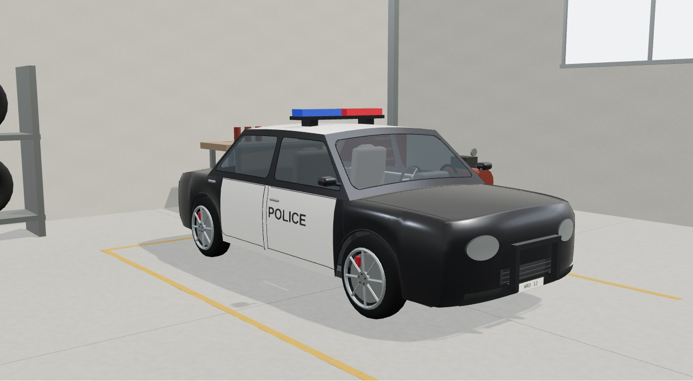
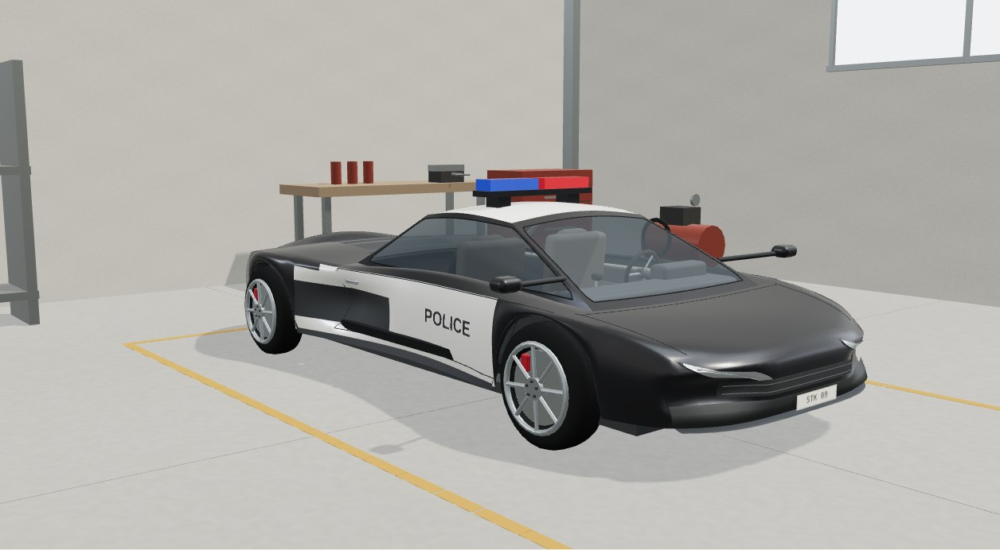
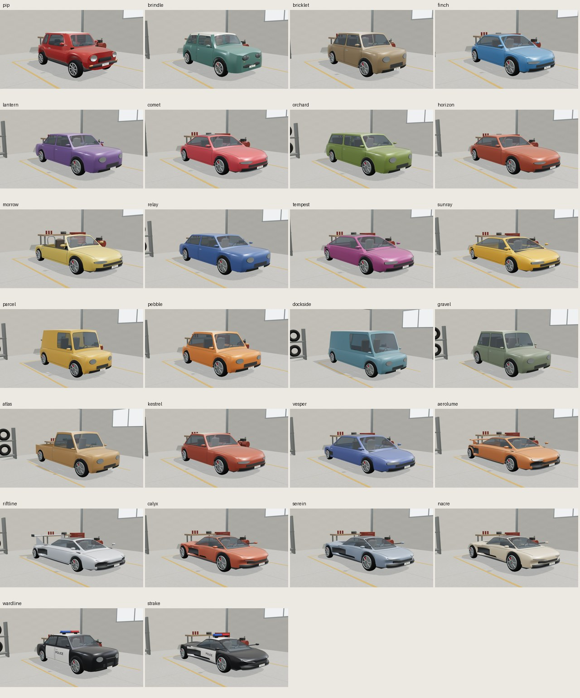
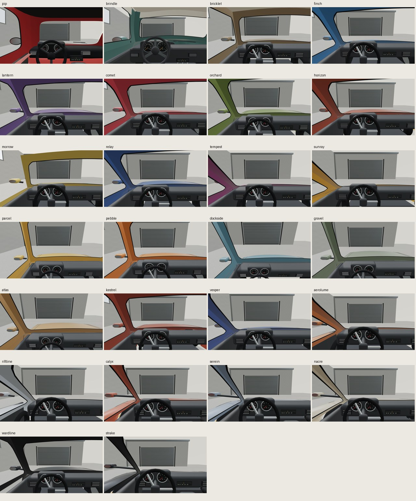

# Original police model previews

**Wardline Patrol** and **Strake Interceptor** are dedicated fictional **parked police variants**, not installed as live cops. Wardline reuses the original four-door Lantern body; Strake reuses the original modern Serein body. They add actual black/white hull partitions, contrasting roofs, two outward POLICE text surfaces, supported fixed red/blue lightbars and a compact Wardline pushbar. No OEM artwork, real agency crests, siren/flashing animation, mounted weapons or new police mechanics. Originality/names are not legal clearance.

[Open the 26-car studio](../../assets/car-arcade/showcase/index.html) | [Executed scope, source and workers](../car-police-studies-plan.md)

| Variant | Rear | Physical cockpit |
| --- | --- | --- |
| Wardline Patrol | [View](wardline-rear.jpg) | [View](wardline-cockpit.jpg) |
| Strake Interceptor | [View](strake-rear.jpg) | [View](strake-cockpit.jpg) |

[Strake 390px exterior UI](390-exterior-ui.jpg) | [Strake 390px cockpit UI](390-cockpit-ui.jpg)

## Actual evidence

Frozen source **81d0247**, [exact source hashes, real snapshots and stored JPEG hashes](evidence.json). Main's installed-system-Chromium visual-only process exits **0 / 366.7835s**: 63 images, **4,979,109 capture JPEG bytes**, zero recorded errors, frozen/local requests, nonblank frames, actual physical cockpit eyes, 19–20 live textures, ordinary ten-click rear rotation/reset and genuine keyboard/touch at390px. Main opened both new fronts/rears/cabins, both full contact sheets and mobile UI. Stored only the six new full-size views, four mobile views and two contact derivatives: **12 JPEGs / 1,333,806 bytes**. Other full-size images remain in the external evidence folder; no duplicated24-old full-size gallery.

Main independent26factories/twofreshcycles (52builds) pass finiteUV/normals/ground/fourwheels/instruments/map-free factories, disjoint resources/exactly-once disposal and physical police tests: actual livery face groups cover the retained hull exactly, unchanged base shape/eyes, red/blue lens volumes above glazing, roof-support contacts, two text surfaces/outward orientation/uprightUV/canvasPOLICE/sRGB and body attachment. All24 older fingerprints byte-identical; originalPip/Brindle and live16 factory regressions pass. Wardline **28,030triangles/41meshes**, Strake **28,074/36**. Police each10freshmaps/**1,048,576baseRGBAbytes** (one added256x64 lettering map); old24 remain9maps/983,040bytes. Mip overhead separate; factory30k/75 and1MiBbase budgets unchanged.

These are stylized civilian-derived variants with shared analogue cabins and simple box accessories. Lettering loses clarity at small sizes/grazing angles; no all-angle photographic/artistic-parity guarantee. A separate actual-triangle sampling diagnostic found all4,096 sampled letter-surface points outside the hull, minimum gap about.00067m; not a universal intersection certificate or native font test. No special police stats, powers, pickups, AI change, live-game livery/lightbar or chase-balance improvement claimed. Current live cops still use the cached gameplay fleet's white tint.

Visual readiness60s/navigation20s does **not** clear the unchanged focused20s startup hold. City natural escape/process-exit, earned-five-kit effects, Garage reset, Foldwild/2048, hardware/rights and full-release gates remain separate. No liveGame/factory/fleet/save/catalog/vendor changes, new games, registration or push.

## All current studies, fresh capture

