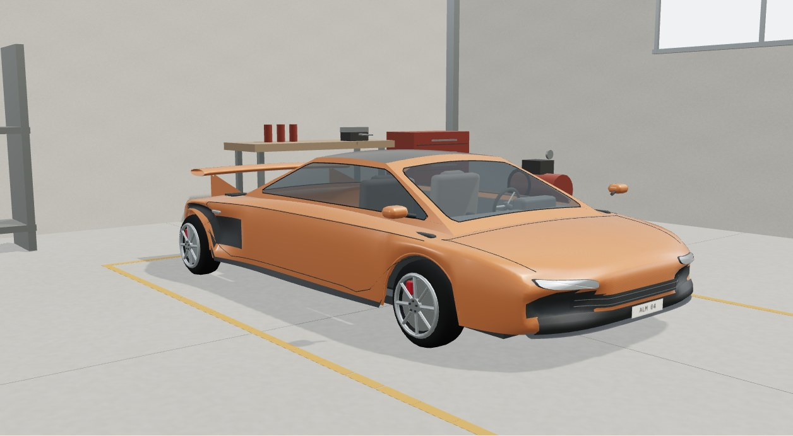
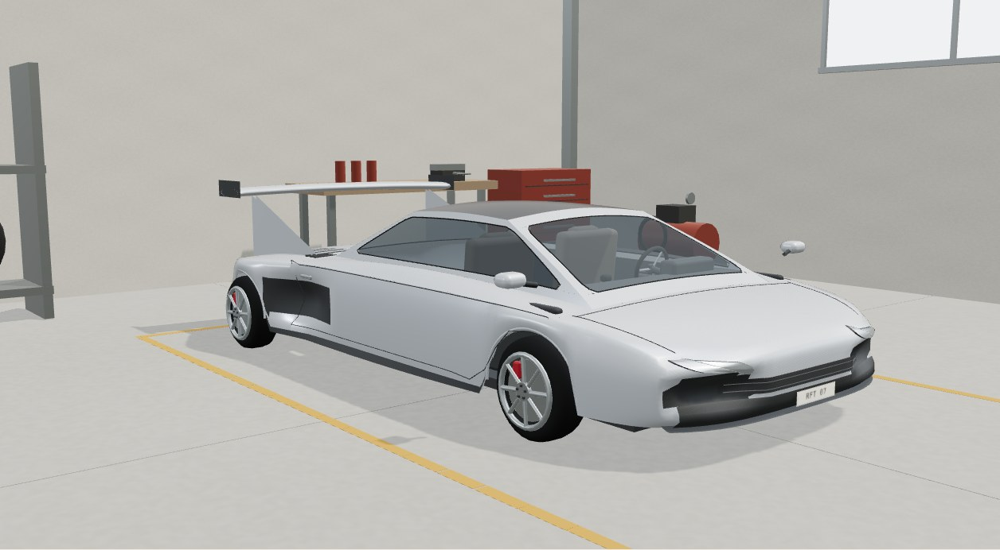
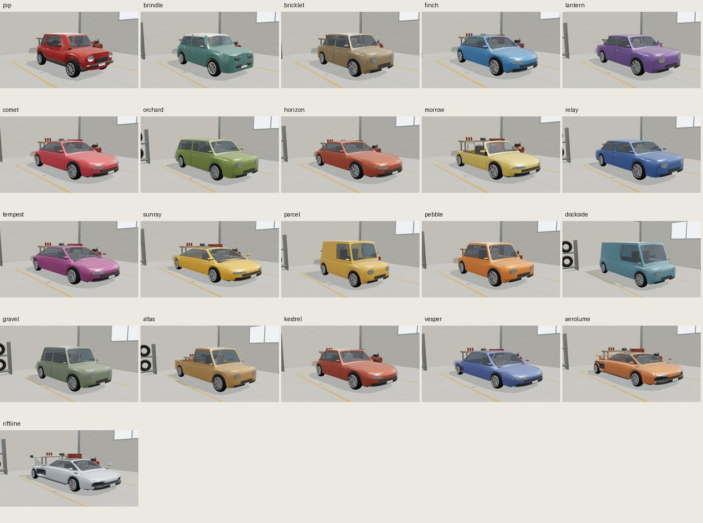
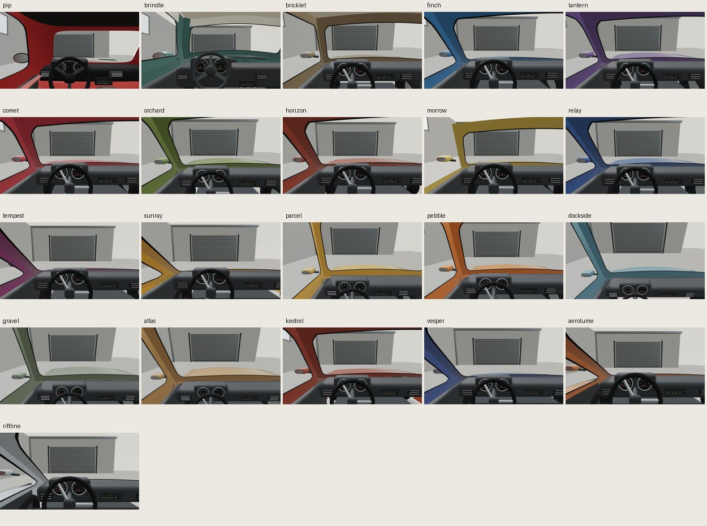

# Reviewed polish and original hypercar previews

Actual local 3D renders, not photographs or AI-generated substitute images. Newest source **ebba1db**, models-only: seventeen generated studies polished before adding original **Aerolume** (low road hypercar concept) and **Riftline** (track prototype concept). Existing Pip/Brindle retained,21 selectors total. Live16 driving models, Games, fleet, saves, vendor and catalog unchanged; no new games/registration/push. Sports performance is design intention, not mechanical proof or legal clearance. No imported/copied OEM assets, logos, traced branded templates or photography.

Visible fixes: joined outward body stampings, analytic rounded-part normals, proper crowned-hood rounding rather than a false recess, slim attached splitters/lamps/mirrors, curved dash/seats, narrowed hypercar cabin and actual head/light positioning. Intakes are colored faces of the true recessed hull, not near-coplanar overlays. Old gallery remains historical at f9169da. These remain stylized; polygonal intake boundaries, simplified wing-support joins, shared analogue cabins/trim and family body forms still limit refinement. No blanket artistic-parity/photo-quality certification.

## Evidence

[Exact source hashes and real snapshots](evidence.json). Final frozen visual-only process **exit0/232.6113s**,48 actual captures:21 exterior/cabin pairs,2 hypercar rear views via ordinary rotate buttons and reset,4 Riftline390px UI/keyboard/genuine-touch captures. Zero recorded browser/network errors, all frozen/local requests, actual physical camera eyes, nonblank content,19 live textures. Capture JPEGs3,758,558bytes; two labeled contact derivatives also stored. Navigation20s/readiness60s is visual-only and does NOT clear the unchanged20s focused startup hold or hardware/driving/gameplay/rights/release gates.

Main independent21x2 factory/geometry/UV/ground/physical-instrument/aero/disjoint-resource checks pass: Aerolume28,806tris/29meshes, Riftline29,094/29, each9 textures/983,040baseRGBAbytes; mip overhead separate. Other17 generated models20,862–27,398tris/28–29meshes, oldPip/Brindle unchanged. Actual rays guard hull/overlay conflicts and dashboards outside the narrow cabin. Old study/live16 regressions pass. [Full source/provenance and qualified outcomes](../car-polish-hypercars-plan.md).

Earlier hypercar batch at05fa709 exited0/227.3055s but was **visually rejected** for intersecting intake overlays and exposed dashboard. ebba1db is the root-directed hull coloring/cabin correction, not a screenshot-only patch or weakened assertion. Earlier fleet polish first batch also retained a hood dent; d681c7a corrected it before additions. Reports preserve both failures rather than treating technical screenshot exit0 as polish.

## New original concepts

[Road aero bridge/rear](aerolume-rear.jpg) | [Track wing/diffuser/rear](riftline-rear.jpg) | [Riftline mobile UI](390-exterior-ui.jpg) | [Physical mobile cockpit](390-cockpit-ui.jpg)

## All current studies

| Model | Exterior | Cockpit |
| --- | --- | --- |
| Pip Borough | [Preview](pip-exterior.jpg) | [Preview](pip-cockpit.jpg) |
| Brindle Borough | [Preview](brindle-exterior.jpg) | [Preview](brindle-cockpit.jpg) |
| Bricklet80 | [Preview](bricklet-exterior.jpg) | [Preview](bricklet-cockpit.jpg) |
| Finch Sport | [Preview](finch-exterior.jpg) | [Preview](finch-cockpit.jpg) |
| Lantern Saloon | [Preview](lantern-exterior.jpg) | [Preview](lantern-cockpit.jpg) |
| Comet Coupe | [Preview](comet-exterior.jpg) | [Preview](comet-cockpit.jpg) |
| Orchard Wagon | [Preview](orchard-exterior.jpg) | [Preview](orchard-cockpit.jpg) |
| Horizon GT | [Preview](horizon-exterior.jpg) | [Preview](horizon-cockpit.jpg) |
| Morrow Roadster | [Preview](morrow-exterior.jpg) | [Preview](morrow-cockpit.jpg) |
| Relay Touring | [Preview](relay-exterior.jpg) | [Preview](relay-cockpit.jpg) |
| Tempest Sprint | [Preview](tempest-exterior.jpg) | [Preview](tempest-cockpit.jpg) |
| Sunray Halo | [Preview](sunray-exterior.jpg) | [Preview](sunray-cockpit.jpg) |
| Parcel Cub | [Preview](parcel-exterior.jpg) | [Preview](parcel-cockpit.jpg) |
| Pebble Rally | [Preview](pebble-exterior.jpg) | [Preview](pebble-cockpit.jpg) |
| Dockside Van | [Preview](dockside-exterior.jpg) | [Preview](dockside-cockpit.jpg) |
| Gravel Scout | [Preview](gravel-exterior.jpg) | [Preview](gravel-cockpit.jpg) |
| Atlas Utility | [Preview](atlas-exterior.jpg) | [Preview](atlas-cockpit.jpg) |
| Kestrel R | [Preview](kestrel-exterior.jpg) | [Preview](kestrel-cockpit.jpg) |
| Vesper GT | [Preview](vesper-exterior.jpg) | [Preview](vesper-cockpit.jpg) |
| Aerolume | [Preview](aerolume-exterior.jpg) | [Preview](aerolume-cockpit.jpg) |
| Riftline | [Preview](riftline-exterior.jpg) | [Preview](riftline-cockpit.jpg) |
