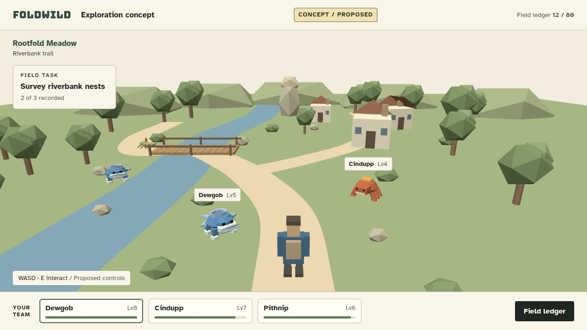
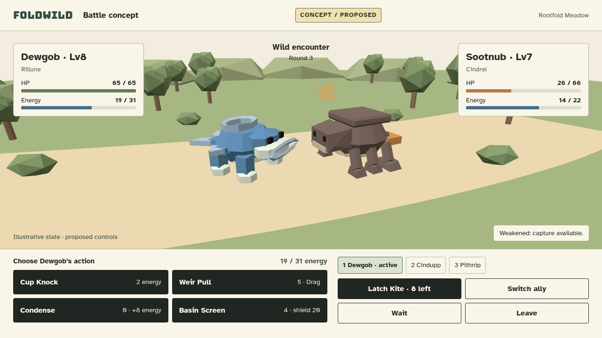
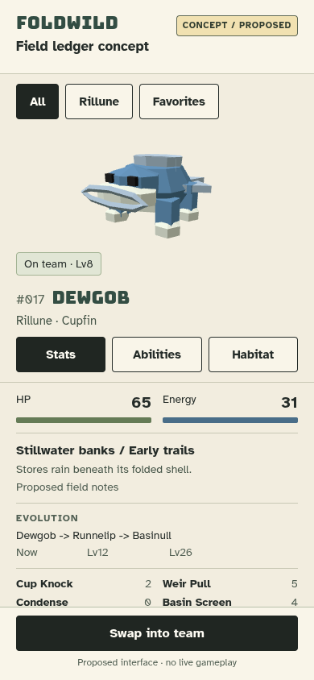

# Foldwild: approval-only concept captures

**CONCEPT / PROPOSED. These are rendered mockups, not current gameplay.**
Main personally reviewed all three captures and accepted them as visual-direction
proposals. Operator approval of the development plan is pending; these images
are not a GO, gameplay/build acceptance, or release.
Foldwild remains unregistered and its future catalog id remains unresolved.
The current catalog contains 115 games; this task adds none.

## Captures

### 01: Exploration concept



Proposed Rootfold Meadow riverbank approach: third-person blue-coat explorer,
curving trail, bridge, cottages, folded stone landmark, three-member team HUD,
and a compact field task. Four real model instances: Dewgob twice, Cindupp,
and Pithnip. Two projected wild labels keep the scene readable. The field task,
location, wild levels, collection count and team condition are illustrative.
The task system and controls depicted here are not wired or demonstrated.

### 02: Battle concept



Proposed one-active-creature duel on a shared meadow trail: supplied Dewgob and
Sootnub models, four canonical Dewgob abilities, ally tabs, and proposed capture,
switch, wait and leave controls. The paper Latch Kite is a temporary two-triangle
concept prop, not a supplied creature or an accepted runtime asset.

The round, current HP/energy and eight remaining kites illustrate a possible
state, not a battle result. Dewgob at level 8 has canonical maxima 65 HP and 31
energy; Sootnub at level 7 has maxima 66 HP and 22 energy. The shown enemy
26/66 HP is below half. Ability names and costs come from the existing data:
Cup Knock 2, Weir Pull 5 with Drag, Condense 0 restoring 8 energy, and Basin
Screen 4 shielding 20. No battle logic was implemented or exercised.

### 03: Field ledger concept



Proposed portrait ledger with the actual Dewgob GLB, canonical number 017,
Rillune element, Cupfin family, level-8 maxima and four abilities. Canonical
progression is Dewgob to Runnelip at level 12 to Basinull at level 26. The
habitat and shell/rain field note are explicitly proposal copy, not additions
to canon. Filters, tabs and team swapping are indicative controls only.
The illustrated visual ledger, search/sort and habitat presentation are proposed
upgrades. The existing game already has a text collection and team editing;
none of the controls in this mockup are wired.

## Source and permission boundaries

- Only existing delivered models were imported, via `BY_ID` canonical paths:
  `Games/Foldwild/models/Cupfin/dewgob.glb`,
  `Games/Foldwild/models/Kilnback/cindupp.glb`,
  `Games/Foldwild/models/Kilnback/sootnub.glb`, and
  `Games/Foldwild/models/Rootspindle/pithnip.glb`.
  Original model geometry, vertex colors and materials were not edited;
  display framing uses uniform scales, translation and rotation only.
- Trees, shrubs, hills, paths, river, bridge, cottages, stone marker, explorer
  and kite are original temporary procedural 3D concept props. They are not
  accepted runtime assets. No new or hidden species was fabricated.
- [Foldwild source evidence](foldwild-sources.md) and
  [model-delivery inventory](monster-model-delivery.md) retain the complete
  provenance and permission limits. Operator-scoped use authorizes these
  concepts. Embedded creator/CC0 assertions are unverified, not independent
  artwork licensing or broad redistribution clearance.
- Rendering uses the existing local three.js r160, GLTFLoader and utility,
  with the retained [MIT notice](../Games/Foldwild/vendor/LICENSE).
  [Existing vendor credits](../Games/Circuit%20Ward/CREDITS.md) and the source
  evidence describe the reuse; MIT covers the library, not supplied artwork.
- Existing local Bungee headings and Atkinson Hyperlegible body/control fonts
  were used. See [font attribution](portal-font-sources.md),
  [Bungee OFL](../assets/fonts/bungee/OFL.txt) and
  [Atkinson Hyperlegible OFL](../assets/fonts/atkinson-hyperlegible/OFL.txt).
  No dependencies, fonts, models or CDN resources were downloaded.

## Capture metadata

Native Chromium rendered actual GLBs with local r160 WebGL 1, hemisphere and
sun-like directional lighting. Flat backgrounds and matte faceted procedural
props are intentional. There are no shadows, bloom or postprocessing. PNGs
are direct browser screenshots, not paintovers or fabricated gameplay frames.

| File | Dimensions | Bytes | SHA-256 |
| --- | --- | ---: | --- |
| `01-exploration.png` | 1280 x 720 | 102219 | `2f39a1a0a49cc5ed8fa2765b20e74c6afaa3e53a272b9cddbaff980ad107baa4` |
| `02-battle.png` | 1280 x 720 | 96024 | `6d6d729d230923b76fcfb0bc6f96e75302c17d496d51bc899d58ea6ce24b8581` |
| `03-ledger-mobile.png` | 390 x 844 | 48152 | `7548a88b572c54ef3ae5a156706c0f884a05137a277fa15b3bba916d5f94f2f6` |

Total PNG payload: **246,395 bytes**.

| Screen | Loaded GLB instances | Draw calls | Rendered triangles | Canvas |
| --- | ---: | ---: | ---: | --- |
| Exploration | 4 | 121 | 4562 | 1280 x 570 |
| Battle | 2 | 53 | 2170 | 1280 x 464 |
| Ledger | 1 | 1 | 536 | 390 x 202 |

These are measured static-frame counts, not FPS, device performance, memory
budgets, Chromebook acceptance or full-engine profiling.

## Verification and repository hygiene

Delegation 40 verified actual `PI_PROVIDER=openai-codex` and
`PI_MODEL=gpt-6.1-sol`. Temporary source and assertion-based capture checks were
kept outside the repository in the dedicated proposal-art scratch directory.
A bounded local Python HTTP server and Playwright drove one Chromium page,
serially capturing all three screens after fonts and selected GLBs loaded and
`window.conceptReady` became true. Both browser and server terminated.

Actual final output digest:

```text
render exit: 0
provider=openai-codex model=gpt-6.1-sol
issues=[] seconds=16.55
model instances: exploration=4 battle=2 ledger=1
horizontal overflow: false for all three
page heights: 720 / 720 / 844
all indicative buttons: height >= 44px
PASS: catalog=115; schema/unique IDs/tracked URLs; Foldwild unregistered
```

The issues array covers console errors, page errors, failed requests, every
HTTP response at or above 400, and non-local requests. All were zero across
the final three captures. Temporary module syntax check exited 0. Screens use
one light palette; no dark-theme or working-input claim is made.

The original sparse selection was snapshotted as `assets`, `docs`, `scripts`.
Only `Games/Foldwild` was temporarily added (8,834,747 bytes), then the exact
three original entries were restored before commit. Game-tree diff was empty
and its tracked tree listing unchanged. Scratch/art payload stayed below 1 MB;
the narrow checkout plus outputs stayed below the 30 MB growth limit. Disk
free sampled 2,574,835,712 bytes before materialization and 2,574,704,640 bytes
after restoration, safely above 2 GB. Git object storage may add a small amount.

Only these three PNGs and this document belong to this commit. Main owns the
separate development plan. No source-game, gameplay, portal, catalog, backend,
protected-game or dependency files were changed. No registration, push or
history rewrite occurred. Full smoke was not run for this documentation-only
task: **zero full-game gate passes**. The mandatory full registered-game smoke
and other release gates still apply before any future push.
