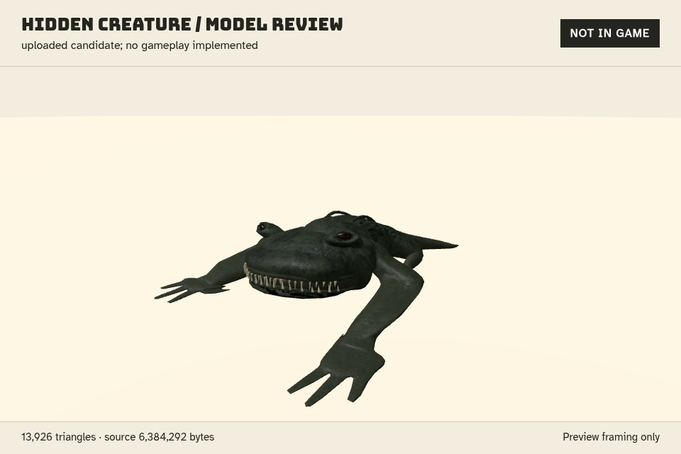

# Foldwild: uploaded hidden-model candidate review

## Decision status

**Planning only, pending owner GO.** An operator-uploaded `secret-cave-creature (2).glb` is now delivered for review. It is not ingested, registered, named as a species, assigned statistics, or implemented as an encounter. `OPTIONAL_HIDDEN_SPECIES` remains `null`; the base 80-species roster is independent of this candidate. No runtime, catalog, portal, dependency, or backend changes were made. No push.

- Input: **6,384,292 bytes**.
- SHA-256 before audit and after browser review: `bc77d7c17a4638f37acb5547a490f50f07fda818f6261e6767e674823d64562c`.
- Review permission is scoped to the operator upload. Creator identity, exporter metadata, source, redistribution license, and any originality assertions remain unverified. Hash equality proves unchanged bytes, not rights.
- Triangle-budget result: **PASS, 13,926**, within the optional-model target of 10,000–15,000 and the 15,999 hard cap.
- Format decision: **PENDING**. This is a textured, four-material candidate, not the one-material flat `COLOR_0` contract used by the 80-model roster. The existing strict `audit_glb` raises `not one node/mesh/material`; that contract rejection is not evidence of broken glTF. The auditor and roster contract were not changed.
- Loader review: **PASS in the review browser**, not low-end Chromebook certification or comprehensive glTF certification.



Caption: uploaded candidate; no gameplay implemented. Original material factors and textures are retained without tinting or replacement horror geometry. Lighting and uniform framing scale belong only to the preview. Owner judgment on appearance, suitability, and approval remains pending.

## Decoded structure and geometry

The existing `unpack_glb` accepts exact JSON + BIN chunks, glTF 2.0, an embedded buffer, correct lengths and padding. The review checks found one scene, one joined node and mesh, four primitives/materials/textures/images, 16 accessors, and 20 bufferViews. There are no skins, animations, cameras, morph targets, declared/attached extensions, required extensions, or external resource URIs. Embedded metadata was not executed or treated as attribution evidence.

Every bufferView was checked against BIN bounds. All 16 accessors were decoded, with POSITION/NORMAL/indices using the existing `decode`; a bounded float VEC2 loop handled UVs because that decoder does not support VEC2. Attribute counts, finite values, alignment, stride, declared POSITION bounds, material/texture/image references, and actual index ranges passed. No malformed case was waived.

| Primitive / material | Vertices | Actual uint16 indices | Index range | Triangles |
| --- | ---: | ---: | --- | ---: |
| 0 | 10,915 | 37,764 | 0–10,914 | 12,588 |
| 1 | 151 | 780 | 0–150 | 260 |
| 2 | 278 | 1,434 | 0–277 | 478 |
| 3 | 480 | 1,800 | 0–479 | 600 |
| **Total** | **11,824** | **41,778** | Each within its attribute count | **13,926** |

All primitives use mode 4 triangles and float POSITION/NORMAL/TEXCOORD_0; none uses COLOR_0. UV ranges are respectively `(0.008601, 0.011143)` to `(0.979821, 0.991399)`, `(0, 0)` to `(1, 1)`, `(0, 0.002203)` to `(1, 0.997786)`, and constant `(0, 1)` on the untextured fourth primitive. Normal lengths span approximately 0.999999960–1.000000044. This does not assert flat normals, winding/degeneracy certification, or roster dimension compliance.

The existing `matrix(node)` returns identity. Actual transformed POSITION bounds, in source units:

- Minimum XYZ: `(-1.388685465, 0.000000000, -1.626649737)`.
- Maximum XYZ: `(1.388692498, 0.801636815, 2.084648609)`.
- Extents XYZ: `(2.777377963, 0.801636815, 3.711298347)`.

Y starts at ground level; no hidden-model size specification was supplied. Under the proposed one-unit-to-one-meter mapping these numbers would be meters, not an approved gameplay size. The preview recenters XZ and uniformly scales by `1.131679431`, producing extents `(3.143101512, 0.907195895, 4.2)` solely to frame the image. No source transform or bytes were changed.

## Textures and material cost

Pillow, already installed, verified each embedded image's actual format, headers and dimensions. The earlier assumption that every image was PNG is incorrect: **two PNG and two JPEG**. This is not a model failure. All are RGB and within the review's 4096-pixel per-axis rejection ceiling; no silent resizing or conversion occurred.

| Image | Format | Embedded bytes | Dimensions | RGBA8 base estimate |
| --- | --- | ---: | --- | ---: |
| 0 | PNG | 3,416,288 | 2048 × 2048 | 16 MiB |
| 1 | JPEG | 732,367 | 2048 × 2048 | 16 MiB |
| 2 | JPEG | 1,538,042 | 2048 × 2048 | 16 MiB |
| 3 | PNG | 230,915 | 512 × 512 | 1 MiB |
| **Total** | | **5,917,612** | Four unique used images | **49 MiB** |

Conservative RGBA8 accounting is `sum(width × height × 4) = 51,380,224 bytes`; adding a full mip chain at 4/3 gives approximately **68,506,966 bytes / 65.33 MiB**. This is an estimate, not measured GPU allocation. RGB images may use different storage; loader/driver/decoded CPU copies add separate costs. JPEG file size is not GPU texture footprint.

There are four unique used texture indices and four unique used image indices, all used once as image sources. Native loader inspection found **four texture objects**, not five: material 0's roughnessMap and metalnessMap share one object.

| Material | Base factor RGBA, rounded | Metallic | Roughness | Maps / source image |
| --- | --- | ---: | ---: | --- |
| 0 | `(1, 1, 1, 1)` | 0 | 1 | normal / 0; base color / 1; metallic-roughness / 2 |
| 1 | `(0.019, 0.020, 0.014, 1)` | 0 | 0.4 | None |
| 2 | `(1, 1, 1, 1)` | 0 | 0.2 | base color / 3 |
| 3 | `(0.39, 0.35, 0.24, 1)` | 0 | 0.38 | None |

All four are OPAQUE and double-sided; all emissive factors are zero. No emissive or occlusion maps are present. Material 0's normal scale is 1. The preview preserves these factors, including non-matte roughness values; it does not force all surfaces matte. Double-sided rendering and normal/roughness sampling are additional low-end cost considerations.

### Low-end Chromebook gate remains open

At review time the provisional baseline was an N4020 / Intel UHD 600 Chromebook with 4 GB RAM, DPR 1, a 960 × 540 low preset, and a measured 30 fps gate. The owner's subsequent provisional specification is an Intel N100 with 8 GB RAM / 64 GB storage; the [current development plan](foldwild-development-plan.md) uses that primary target with a 60 fps standard goal and the 30 fps low fallback. **This review tested neither Chromebook and did not measure fps.** Software-renderer timing is not a performance claim. Triangle fit alone cannot establish compatibility, especially with approximately 65.33 MiB of estimated mipmapped RGBA8 textures on one optional model.

If owner GO permits optimization, consider a separate 512–1024 texture set or an atlas after material/UV review, while retaining this original unchanged. A naive atlas can break normal or metallic-roughness interpretation; atlas suitability is not established here. Test loading, memory/context stability, frame pacing and a representative full scene on actual target hardware before accepting the candidate. No textures were converted, no model was simplified, and no optimized derivative was ingested during planning.

## Native local-browser evidence

A bounded loopback-only server served one explicit `/candidate.glb` route directly from the read-only input, plus preview files, existing local Bungee/Atkinson fonts and unmodified vendored Three.js r160 / GLTFLoader / BufferGeometryUtils. No CDN, remote assets, exporter execution, installation, dependency declaration, or model copy into the repository was used.

Playwright used installed Chromium with a forced **WebGL 1.0 (OpenGL ES 2.0 Chromium)** context, DPR 1, one canvas/renderer/scene, no animation loop, shadows, postprocessing or bloom. Its actual `MAX_TEXTURE_SIZE` was **8192**, sufficient for the largest 2048-pixel images. The review frame is 960 × 640 with a 960 × 500 canvas, not the proposed gameplay performance viewport.

After an actual loaded render, renderer counters were:

```text
Three revision: 160
Model triangles: 13926
Renderer draw calls: 5
Renderer triangles: 13928
Renderer geometries: 5
Renderer texture objects: 4
```

The candidate requires at least **four draws** for its four primitives. The fifth draw and two extra triangles belong to the review floor. A single scene and renderer were reused for three-quarter/front/side/back captures, not four parallel GPU contexts.

```text
PASS: browser load and four serial captures
console errors: 0
page errors: 0
failed requests: 0
HTTP 4xx/5xx: 0
nonlocal requests: 0
local requests: 12
source SHA-256 before == after: true
```

Textures, image bitmaps, geometries and materials were disposed, renderer/context released, browser closed and server shut down in cleanup. The retained JPEG is a direct native screenshot, **960 × 640, 38,786 bytes**, SHA-256 `c559f2eaebc45e51009d0c0f1b4ad601c977a6eb7bc914ad4aa295992a84d4d0`. Uncommitted front/side/back captures and audit/browser JSON remain in the review scratch folder for the owner, not as shipped runtime assets.

## Commands and boundaries

Set `MODEL` to the local operator-supplied file and `REVIEW_TMP` to the existing scratch evidence folder; do not put personal paths into committed commands. The scratch audit and preview tools are review-only, not repository/game scripts.

```sh
python3 -B scripts/audit_monster_archive.py --self-test
python3 -B "$REVIEW_TMP/check.py"
node --check "$REVIEW_TMP/preview.mjs"
# Requires only a temporary narrow Games/Foldwild checkout for existing vendors.
timeout 100s python3 -B "$REVIEW_TMP/render.py"
git diff --check -- docs/foldwild-hidden-delivery.md docs/foldwild-concepts/04-hidden-model-review.jpg
```

The existing auditor self-test returned exit 0 with:

```text
PASS: malformed ZIP paths/collisions/expansion/symlink/encryption/CRC; GLB exact length/chunks/external buffer/accessor bounds; JSON duplicates/nonfinite
```

The candidate scratch audit, final browser run, and documented regression check each returned exit 0. The retained screenshot's identity/dimensions and report privacy/path scans also passed; `node --check` and scoped `git diff --check` returned exit 0. No giant archive re-audit was performed. A small independent input identity/count/image regression check, runnable from the repository root with `MODEL` set, is preserved here:

```sh
python3 -B - <<'PY'
import hashlib, importlib.util, io, os
from pathlib import Path
from PIL import Image
s = importlib.util.spec_from_file_location('audit', 'scripts/audit_monster_archive.py')
a = importlib.util.module_from_spec(s); s.loader.exec_module(a)
data = Path(os.environ['MODEL']).read_bytes()
assert len(data) == 6384292
assert hashlib.sha256(data).hexdigest() == 'bc77d7c17a4638f37acb5547a490f50f07fda818f6261e6767e674823d64562c'
g, binary = a.unpack_glb(data)
assert len(g['scenes']) == len(g['nodes']) == len(g['meshes']) == 1
assert len(g['materials']) == len(g['textures']) == len(g['images']) == 4
assert not g.get('skins') and not g.get('animations')
triangles = 0
for p in g['meshes'][0]['primitives']:
    assert p.get('mode', 4) == 4
    _, positions = a.decode(g, binary, p['attributes']['POSITION'])
    ia, rows = a.decode(g, binary, p['indices'])
    assert ia['componentType'] == 5123 and ia['type'] == 'SCALAR'
    assert len(rows) % 3 == 0 and all(0 <= r[0] < len(positions) for r in rows)
    triangles += len(rows) // 3
assert triangles == 13926
expected = [('PNG', (2048, 2048)), ('JPEG', (2048, 2048)),
            ('JPEG', (2048, 2048)), ('PNG', (512, 512))]
for im, (fmt, size) in zip(g['images'], expected):
    v = a.ref(g['bufferViews'], im['bufferView']); start = v.get('byteOffset', 0)
    with Image.open(io.BytesIO(binary[start:start + v['byteLength']])) as image:
        assert image.format == fmt and image.size == size
        image.verify()
print('PASS: candidate identity, actual index bounds/13926 triangles, four image formats/dimensions')
PY
```

This small check is not the full scratch UV/reference/transform audit or browser verification.

Sparse selection was snapshotted and exactly restored to `assets`, `docs`, `scripts`; the sparse-pattern file comparison passed. Only a temporary narrow `Games/Foldwild` checkout (8.7 MiB) was used, never all Games or the 80 model loads. Original input was not copied. Disk remained above the 2 GB guard. Before/after review free-space readings were 2,563,690,496 and 2,563,411,968 bytes (278,528 bytes less free, before commit; whole-filesystem readings can include concurrent activity). The narrow checkout's tracked files total 8,834,747 bytes; retained scratch/output files were approximately 0.23 MB, giving less than 9.1 MB of known review-file materialization within the 30 MB budget. The browser cache was bounded and its temporary profile closed.

Runtime Git tree/blob comparisons for Games, games.json, index.html, assets, netlify and uv were unchanged; the protected Character AI tree was unchanged. Catalog verification returned `PASS: 115 catalog entries; unique IDs/schema; tracked URLs`. No games were added, ingested or self-made by this task.

**Full-game smoke gate contribution: ZERO.** The mandatory full-game smoke/release gate was not run or claimed for this documentation-only review; a targeted candidate loader test does not replace it. No release approval, gameplay approval, provenance clearance, actual-hardware compatibility pass, or push is implied. Pending decisions include creator/license evidence, textured optional-format acceptance, target-device optimization/measurement, personality, encounter/secret design and balanced combat integration.

Review collection: delegation 41, actual provider `openai-codex`, model `gpt-6.1-sol`, bounded to 15 minutes; only this report and `foldwild-concepts/04-hidden-model-review.jpg` are owned outputs.
