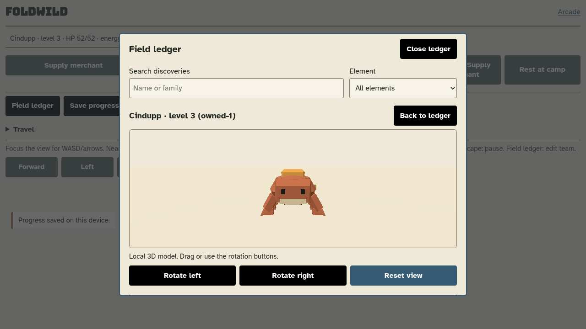
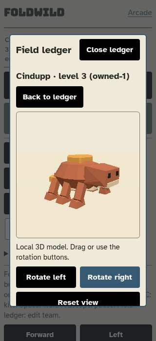
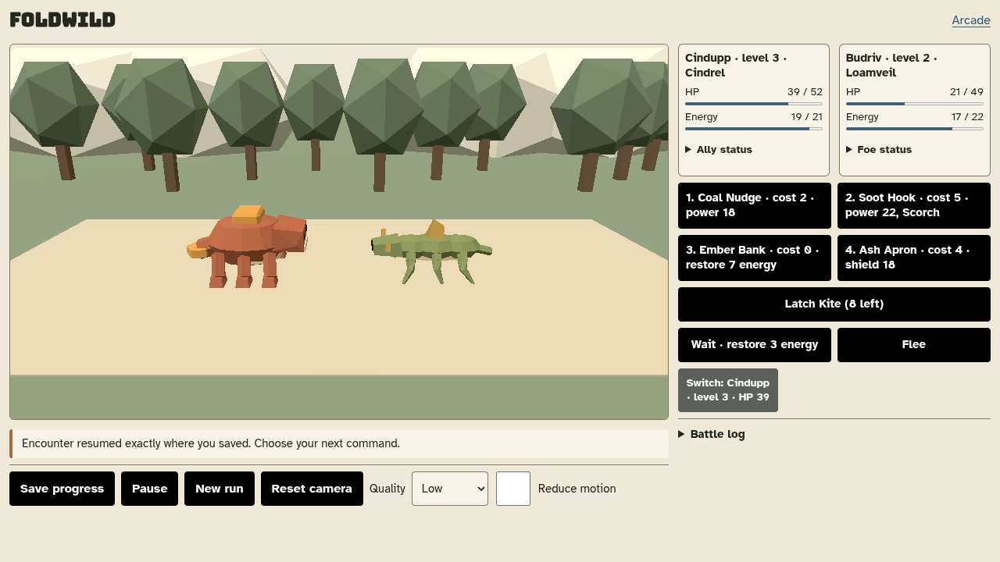

# Foldwild M2 local development review

Status: **IMPLEMENTED; INTEGRATED NATIVE ACCEPTANCE HELD**.
The owner ordered "keep developing". This run worked only on the existing,
operator-authorized original Foldwild. Games added: **0**; new build/register
pairs: **none**. Catalog remains 115; Foldwild is unregistered. No push/publication.

## Changes and evidence

1. **Presentation:** same canvas/renderer/RAF/cache now supports rotatable creature
   inspection. Native standalone checks loaded all 80 real supplied models,
   exercised 120 previews and 40 world/battle/inspection cycles. Cache stayed 12;
   ending resources stabilized at 16 geometries/zero textures. No normal browser,
   request or external errors. These are not N100 FPS measurements.
2. **Continuity and collection:** optional v2 pending-battle saves preserve RNG,
   active members, HP/energy, statuses, shields and buffs; old v1/v2 saves migrate.
   Strict identity/class/enemy/resource checks reject inconsistent snapshots and
   ended/reward-bearing checkpoints. Imported counters are bounded. Pure release
   guards preserve favorites, team members and the last conscious ally, discovery
   history and unrelated resources. No release payout.
3. **Integration:** real desktop merchant/hairstyle/accessory, inspection, native
   weakening, mid-battle Continue, capture, two finished-state reloads and UID
   release/cancellation checks passed in each final uninstrumented attempt before
   the mobile stage failed. Explicit saving and actual evolution-result feedback
   were wired. Natural native evolution is not certified by these short runs.
4. **Review fixes:** badges/scarves now anchor to actual source triangles instead
   of floating at bounding-box extremes. 160 independent geometry-contact checks
   passed. Main reviewed the supplied representative-family captures and corrected
   Budriv/Raymote side/three-quarter views; this is not all-80 aesthetic acceptance.
   Main's inspection-name visibility guard and 72px scroll margin were retained;
   the 320px ledger heading now keeps Close on one row.

Original 80 GLBs remain unchanged: **7,300,844 bytes**, 80 SHA matches; hidden
species remains null. No texture derivative or optional horror activation.

## Honest gate status

Main reran all nine pure commands after the final coding commit `b8b39ca`:

```sh
for x in data regions economy builds battle battle_v2 world save_v2 continuity; do
  node --experimental-default-type=module scripts/test_foldwild_$x.mjs
done
```

All exited 0. Data output includes `80 tracked/local SHA matches`; continuity
output includes `canonical effects/profiles, active index and exact action/RNG
replay` and `immutable release guards/history`. Touched script syntax, Python AST,
`git diff --check`, exact catalog equality and 115 unique tracked URLs passed.

**Fresh uninstrumented M2 integrated passes: 0.** Main's two frozen-source runs
exited 1, four positive desktop stages each, at world readiness after a single
mobile Close tap following 390-to-320 viewport resize. Zero console/page/load/
external errors, source unchanged. Worker 56's final run also exited 1 after its
scoped heading fix. A read-only traced run exited 0 with seven stages and three
negative fixtures, but observation changes timing; it does not supersede the
uninstrumented failures. An earlier background run lost its exit status and is
not a pass. The overwritten shared result JSON belongs to the traced run.

Temporary evidence basenames: `foldwild-m2-final-native{,-2}.log` and matching
status files, `foldwild56-m2-final.log`/`.status`, `foldwild56-full-trace.log`.
See [bounded final checkpoint](foldwild-m2-finish.md). Core implementation used
one initial and one last bounded integration pass; no third worker retry was
started. Root cause of the intermittent touch-close remains unresolved. Operator
clarification tickets `pi-912882-1790904493460` and
`pi-1253312-1790905405820` remained unanswered during the checks.

**New full registered-catalog passes: 0.** No push was attempted. The mandatory
fresh unfiltered gate is still required before any later authorized push.
Full natural campaign/finale, all-species acquisition/fit, class ranks, optional
horror/frontier and actual N100/8GB Chromebook profiling remain open.

## Commits

| Commit | Scope |
| --- | --- |
| `3dd26f4` | Detailed M2 contract |
| `f443f17` | Inspection/release/saving shell |
| `a95ffcb` | Shared-renderer model inspection |
| `cd607fe` | Pending-battle validation and guarded release |
| `f6ac7f5` | Strict export assertion includes release API |
| `9be38a9` | Checkpoint counter ceiling/regression |
| `eac4406` | Core M2 integration and native check |
| `aee7771` | Triangle-contact accessories and check |
| `b8b39ca` | Mobile heading/name checks and held checkpoint |

## Actual gameplay previews

These snapshots came from real browser interactions in the temporary traced run,
not mockups or proof of a clean final gate. Main reviewed them. They show the
unfinished M2 build; do not describe them as release acceptance.







## Storage and handoff

Tracked logical growth from `3f2c94a` through `b8b39ca`: **125,142 bytes**, before
this handoff and its three previews. This is not physical disk reclamation or
exclusive filesystem accounting. No new game/model materialization beyond the
existing narrow Foldwild checkout; final root free space approximately 2.4 GiB.
Main restores the original sparse selection (`assets`, `docs`, `scripts`) after
committing this handoff, checks Git clean, and leaves no coding worker/test server
running. Next acceptance work must resolve the native mobile close, not weaken
its test or mistake the traced run for a stable pass.
