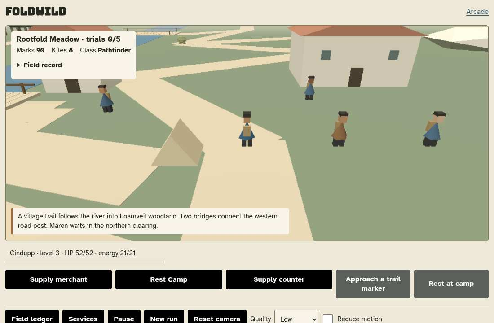
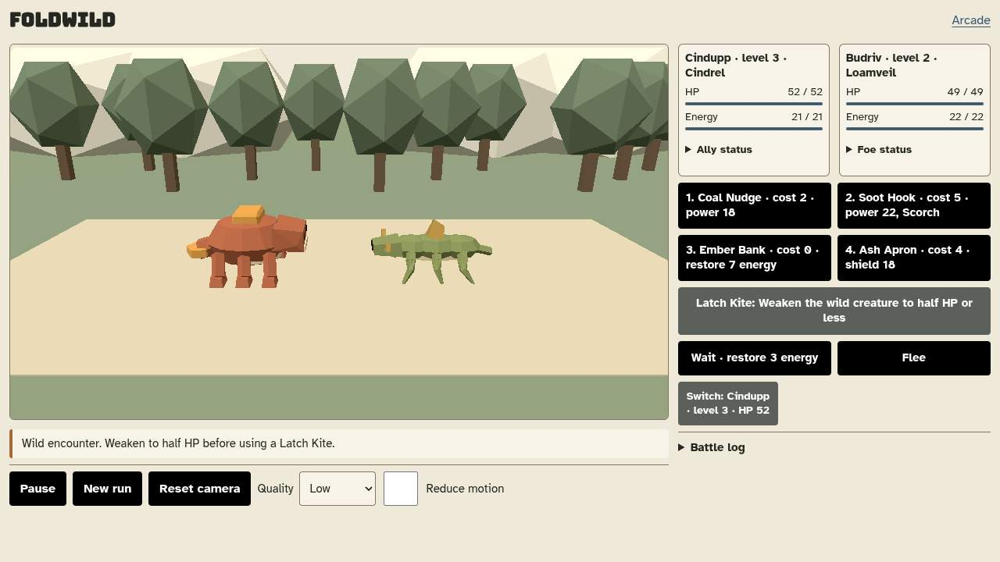
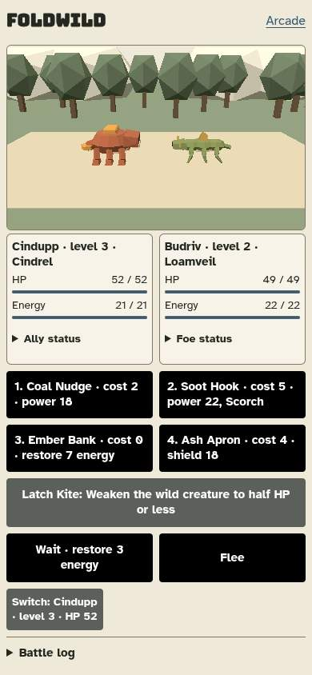

# Foldwild implementation previews

These are real native-browser screenshots of the local M1 playable build, not
concept mockups. Main reviewed all three. They are not campaign completion,
release approval or Chromebook FPS evidence.

## Rootfold village

1100 × 720. Captured by the core integration check at `ae8f371` before the
subsequent mobile layout revision. Native shops, collisions, contracts and
save/Continue were exercised; this scene shows the initial starter and resources.

## Desktop encounter

1280 × 720. Captured by the layout check for `90cfdf8`. Both supplied creature
models and actual abilities/resources are rendered by the game.

## Mobile encounter

390 × 844. Same layout check and real encounter. The earlier opaque-card overlap
was corrected; both creature models, four abilities, capture, Wait and Flee are
visible. The 320-pixel variant was separately captured and reviewed.

## Verification boundary

- [Detailed implementation contract](foldwild-implementation.md).
- [Native M1 mechanical review](foldwild-milestone-review.md): actual capture,
  merchant trades, natural contract/class unlock, saved individual profiles,
  accessories, two-contact input and confirmed/cancelled restart.
- [Corrective layout checks](foldwild-milestone-layout.md): eight native checks,
  no normal browser/load/external-request failures; Main now accepts this layout
  for the M1 preview, not as final collection/campaign polish.
- [Development proposal and remaining milestones](foldwild-development-plan.md).

Only the existing operator-authorized original Foldwild was developed. No games
were added or registered, the 115-entry catalog was unchanged, and nothing was
pushed. Full natural campaign/evolution, all-species cosmetic fit, pending-battle
recovery, final release gate and actual N100 Chromebook profiling remain open.
The optional horror model and procedural frontier are not activated.
