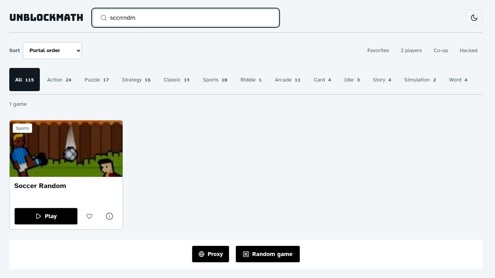
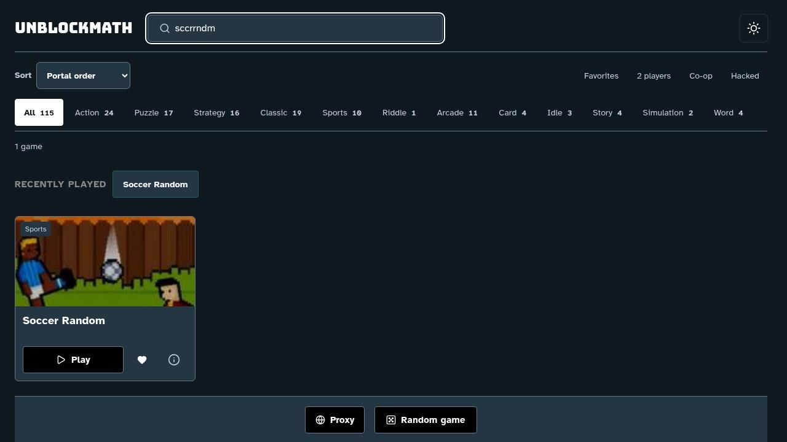
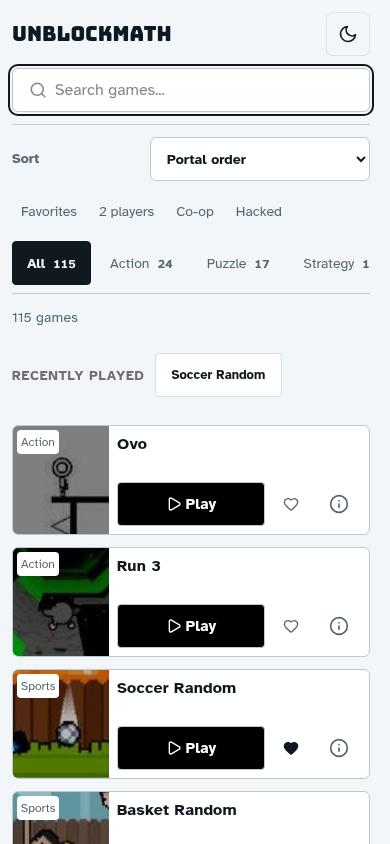
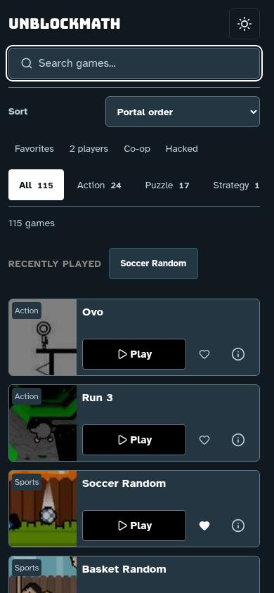
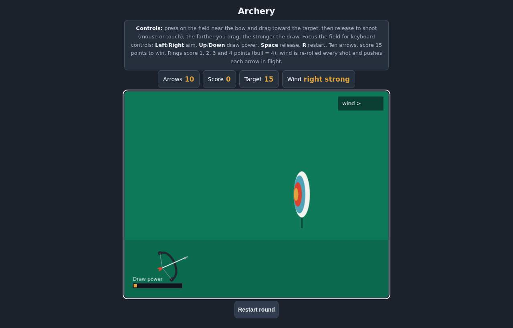
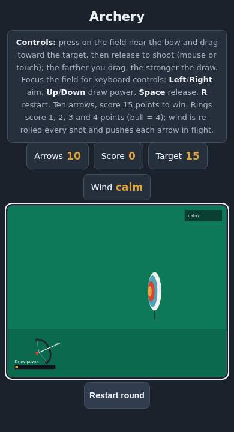
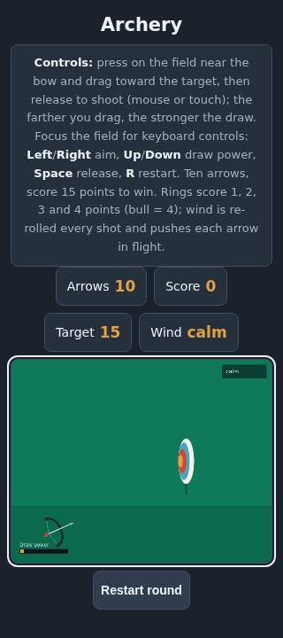

# Reviewed refurbishment previews

These seven images are actual Chromium captures from Main's fresh passing native
runs at source `2d66059cc18f98659fd7f6970dbc0555cb1349a8`. Main opened and assessed
all seven individually after the reruns. [Manifest](previews/manifest.json) records
dimensions/bytes/SHA-256. Total JPEG payload: **236536 bytes**. No concept render,
model substitution or state grant. Images do not prove all-game gameplay, rights,
a full-catalog pass, physical touch hardware or N100 FPS.

## Portal

**Main judgment:** accept unchanged visual layout for the reliability fixes.
Focused search has a clear boundary; one subsequence hit and result count agree;
both themes retain readable cards and black Play buttons. Mobile search/sort,
recent history and compact cards remain legible with obvious favorite state.
Category strip intentionally scrolls; its clipped edge is not whole-page overflow.
320px touch/overflow was actually checked, though these mobile images are 390px.
Screen-reader/OS IME/zoom/dialog background behavior remains separately unverified.
No decorative redesign is claimed.

### Desktop light and dark, 1280x720

### Mobile light and dark, 390x844

## Archery

**Main judgment:** accept the lifecycle/input fix's preservation of the upstream
visuals, not certify an accessibility redesign. The focused field, separated HUD,
controls and Restart remain visible without horizontal overlap at 390/320px.
The field's canvas power/wind microtext becomes too small on narrow screens; that
is a remaining readability task. Desktop requires vertical scrolling to Restart
at the tested viewport, reflected honestly by its full-page capture. Existing
rounded/colors remain upstream style, not newly imposed house polish.

### Desktop 1280x820 full page from a 1280x720 viewport

### Mobile 390x720 and 320x720

The corresponding logs report natural score40 wins on desktop/touch, ten-shot
loss, cancel/reset and stale callback checks. A screenshot of the reset scene is
not a victory-state screenshot. See [Archery evidence](archery-refurbishment.md),
[portal evidence](portal-refurbishment.md) and [integrated ledger](AUDIT.md).
