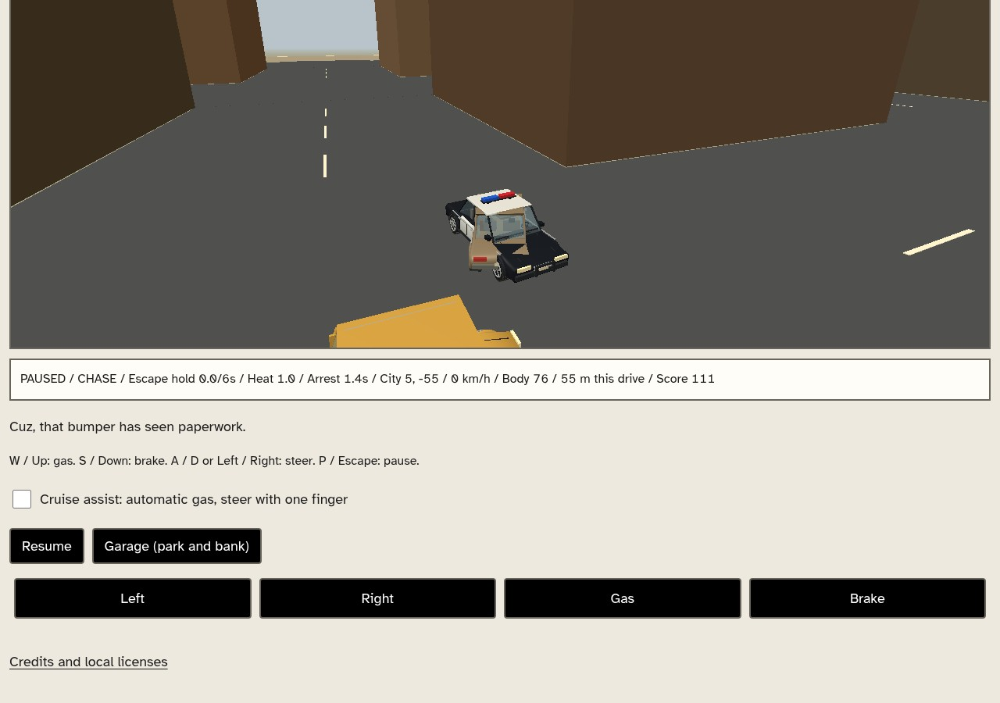
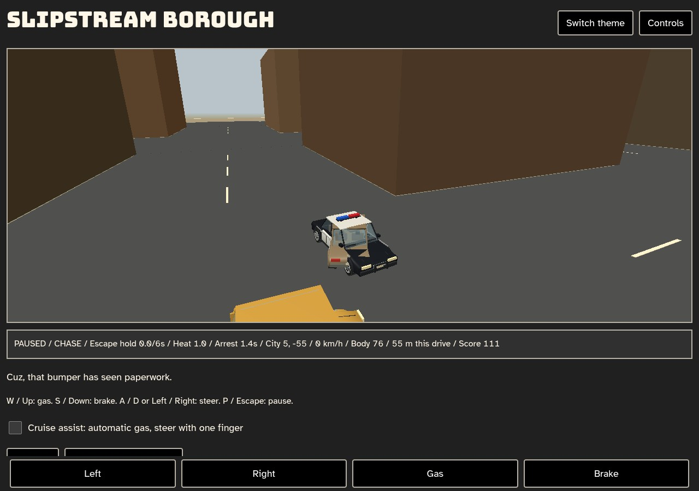
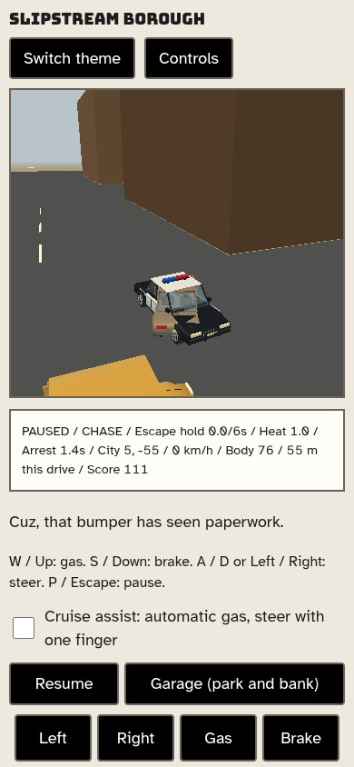
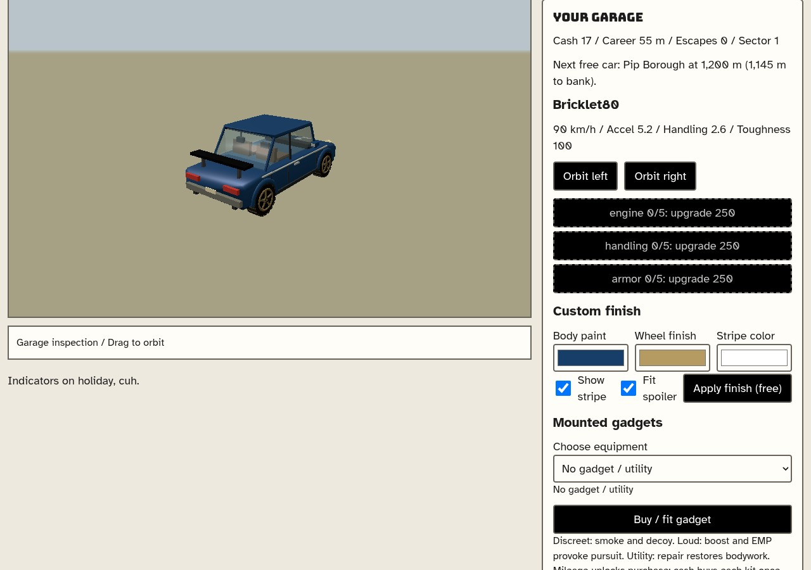
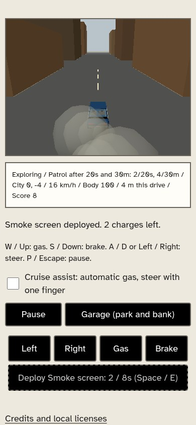
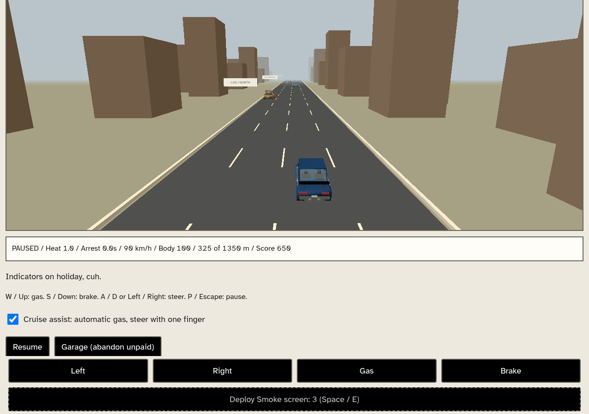

# Slipstream clock and four-car traffic checkpoint

Owner authorized finishing work and gated push; [scope](../slipstream-traffic-release-plan.md). Existing original game only, no new games/build-register pairs/catalog change. Slipstream remains unregistered/unpublished; feature-branch push is not main/deployment.

## Exact runtime records

- Baseline43b6e43 diagnostic only: installed Chromium/SwiftShader, ordinary race UI, CDP sampling/GL timings.12.8272wall seconds/4.3active/87frames; intervalmedian133.3ms,p95216.7ms,max416.6ms.50ms clamp dropped8.2329s, scriptduration .8683s vs task1.9853s. This diagnoses visible time loss, not total GPU cost/target FPS. `clock.js` now bounds250ms/frame and keeps1/60 simulation steps/reset-on-pause; longer hitches still lose time.
- Native1 sourcea1e991680ea8badf145e07515b7993f3e200906a **exit1/18.524841577978805s**: new harness wheel-angle threshold was already true at its first snapshot, so next pose was identical. Exact failure retained in `native-1-failure.json`; not a passing run.353c921 changes the predicate to baseline-relative pose AND wheel-angle movement, not a timeout increase/game-state grant.
- Native2 frozen **353c921f7061723f60201af2038fbc007a196e70**, **exit0/161.6827018270269s**, exact `result.json`/source hashes and process manifest in `evidence.json`. Ordinary fresh city55m park-once, real four-car movement/actual renderer identities/poses/wheels/freeze/removal/reload, moving Wardline city/highway assertions, saved cosmetic stripes12->0->12/one draw, mileage/category locks, natural1200m starter race/free Pip, earned smoke purchase/reload, keyboard/genuine held-touch drive and touch deployment,320/390 overflow/44px controls. Race49.33472092507873wall seconds after steering; original110s deadline and20s readiness unchanged, errors[],assistedfalse. No save seeds/cheats/simulation stepping/snapshot mutation.
- Genuine Astra135:16assistant records exclusively openai-codex-responses/openai-codex/gpt-6-astra/high thinking; **timed out480s/exit143 after b1d49cd**, not a completed delegation. Main independently reviews/tests the owned three-file commit. Routing warning did not change actual recorded model; no routing repair performed.
- Main pure checks: clock-equivalent wall-time schedules and bounded hitch/reset;5traffic groups including230s copied deterministic loop/clearance/spacing/yield/damage-cooldown-armor/no rewards/park once/hostile descriptor rejection;15core/9world/patrol2cycles/base16/Pip-Brindle/26x2parked/syntax/AST/protected bytes/catalog115GitURLs. Source fixtures are synthetic, not natural campaign proof.

## Reviewed frames

Main personally opened all six exact native2JPEGs (**500,063bytes**). No photographic approval: simple arcade buildings/cars, visible existing cop/player interpenetration remains. Yellow civilian car is partly visible at the bottom of city patrol frames; the moving-instance proof comes from actual renderer poses/wheels matched to actual simulation, not a full fleet beauty gallery. Highway cop is behind camera at this chase snapshot; its actual object/identity/pose/wheel assertions pass, screenshot does not certify its lettering legible. Static police lenses remain fixed red/blue, not flashing.

## Remaining limits

One fixed rectangular loop/four civilian NPCs with simple bounded yielding, not general routing or reciprocal police traffic avoidance. Detailed26showroom/Strake remain parked, live16ABI unchanged. Natural city escape/all-five naturally earned effects/current campaign/full difficulty/fleet acquisition, full collision separation/beauty, physical-device FPS and rights remain unverified. Separate Garage reset/Foldwild/2048/studio20s holds are not cleared by this run.

Full unfiltered115registered gate and authorized feature push are pending at this evidence checkpoint. Both earlier live-police110s failures remain preserved in [the older ledger](../slipstream-live-police-previews/README.md); this is a justified clock-root correction followed by new acceptance, not a third blind retry or erased history.
